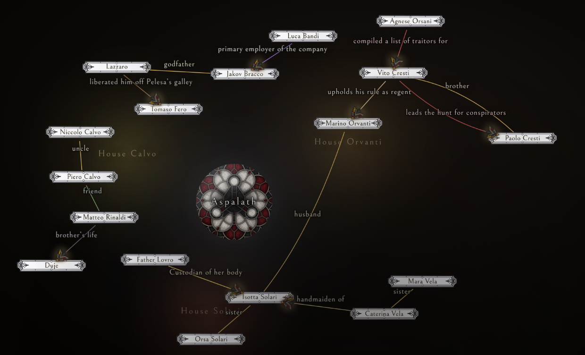

# How the character map finds its seats

Tamás Szentandrási

The public face of a campaign is a hall of names, not a diagram. The ST still draws ties in Obsidian. This page is how the viewer *sits* those names around the rose so a player can read the room.

A hand-arranged Aspalath pass is the target, not a special case:

## What the drawing is

It is a **forest of small trees in polar coordinates**, with **horizontal type** on the ties.

The active Factions category is a lens. People who belong in that category are the **core** of a house. Everyone else is either a **satellite** of the core person they actually touch, or an **island** if they touch no core at all. The company knot is an island. Matteo hanging off Piero is a satellite. House wells paint the core only.

Around the rose the **street is the tangent** and **depth is outward**. Siblings of a tree sit along the street. Each further hop sits further from the rose. A cluster on the left therefore *reads* as a column; one under the rose *reads* as a row. Same rule.

A directed tie is a sentence: agent, then the words, then the arrow, then the patient. Kin is a short gutter with no arrow. Two ties between the same pair take opposite bows; each label sits on the outside of its own curve.

Type never rotates. A long clause wants a wide run of empty air, still *local* to those two plates.

## What we chose, and why

Early passes tried a 3D graph, then a global force soup, then annealing, then long springs that dragged people across the field. Those methods move the wrong object. They mix houses, stretch ink without a sentence, and zoom the camera out to empty wash.

The stack that matches the drawing is small and mostly exact:

1. **Claim.** Multi-source BFS from in-lens people. Each out-of-lens name is claimed by the closest in-lens neighbour on the ties. Unreached components stay islands. A family name that matches a faction in the active category (Isotta Solari → House Solari) counts as in-lens, so map-only people are not dumped on a far orbit.

2. **Root.** In each cluster, the inner face is the in-lens node with the most in-cluster ties (then the most ties that leave the cluster). Islands use highest degree.

3. **Tidy tree.** Buchheim–Jünger–Leipert / Walker’s n-ary tidy tree. On a player map the in-cluster graphs are almost always trees, so this is exact: one hop, one step; no crossings inside the tree.

4. **Polar wrap.** Tidy *x* becomes arc length on the street. Tidy *depth* becomes radius away from the rose. Core faces the rose. Satellites hang off the far side.

5. **Cluster order.** There are a handful of trees. Unique circular orders are few. We brute-force the order that minimises **cross-cluster** crossings. Adjacent houses that share a tie sit next to each other, so a husband line is a corridor, not a diameter.

6. **Ring radius.** Solve so the trees’ widths fit around the rose, then take the larger of that and rose clearance. The field stays as tight as the glass allows.

7. **Local push.** Inverse-square repulsion between neighbouring plates (cut off at 260px) plus a hard ellipse collide. This is air, not a second world solver. Each labelled tie is opened to a minimum run from the clause length, capped at 360px so nothing is yanked across the rose.

8. **Wells.** Dilate the bounding shape of **core plates only**, about 2.15× the pack, never smaller than 280px. Unaligned people are pushed out of that wash.

9. **Route.** Existing clip: leave plates on an ellipse, bulge around the rose, detour a plate on the chord. Parallel ties get opposite curvature.

10. **Labels.** Longest clause first. Candidate slots along the curve, both normals. Score: miss plates, the rose, and other labels; stay close to the ink; directed text prefers the outer bulge. If a clause still has no seat, those two plates are separated along their current line **once**, then we stop.

## Weights

Calibrated for Bellefair nameplates about 138×32:

| | |
|---|---|
| Sibling gutter | 36px |
| Layer step | 48px + 2.8px per letter on that generation |
| Sector air | 44px of arc between trees |
| Label em | 7.4px |
| Pack gap | 32px |
| Push range / G | 260px / 7200 |
| Label span cap | 360px |
| Well | 2.15 × pack, min 280px |

A short kin word (`uncle`, `sister`) fits in the gutter. A long clause (`liberated him off Pelesa’s galley`) gets a longer *local* chord, not a trip across the hall.

## What we left on the floor

Global force, annealing, stress layout, and “long label ⇒ long spring across the map.” Those were tried. They mix cores, invent diameter ties, and fight the rose.

The ST still publishes JSON Canvas. This code only sits what was published.

## Code

Seating and label slots live in `src/lib/map-geometry.ts` (`layoutRose`, `placeEdgeLabels`, `relaxSeats`). The hall camera and house-name lens live in `src/lib/character-map.ts`. Tests in `tests/map-geometry.test.ts`. The archive bundle is `public/map-client.js`.
