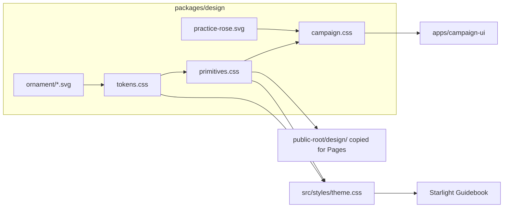
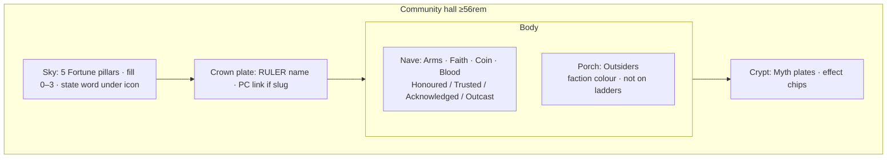

# Propagate Guidebook visual language + Community Tracker UX

| Field | Value |
|-------|--------|
| **Author** | _TBD_ |
| **Date** | 2026-08-23 |
| **Status** | **Historical.** Chrome and several product sentences are **superseded** by [`visual-lock.md`](./visual-lock.md) (2026-08-25). Keep this file for jobs, store fields, and the PR history of the 23 Aug programme. Do not implement new chrome from this document. |
| **Surfaces** | Landing (`public-root/index.html`), community tracker, character sheets, creation docks |
| **Source of visual grammar** | **Was** Guidebook iron-silver plates (2026-08-18 / 08-22). **Now** iron structure + glass light + blood identity — see [`visual-lock.md`](./visual-lock.md). |
| **Related** | [`visual-lock.md`](./visual-lock.md), [`docs/plans/starlight-guidebook.md`](docs/plans/starlight-guidebook.md), [`src/content/docs/automation.md`](src/content/docs/automation.md), [`docs/plans/automation-architecture.md`](docs/plans/automation-architecture.md) |

**Superseded here (do not follow):** no stained-glass chrome; archive as a thinner face; play-time mutation bot-only / no ST web token; inspect drawer; Practice as a casual HUD-or-rose swap; Find as an always-on blood dock or a hidden-until-busy meta row. **Still true:** Fortune purpose; Wanting as a rite; founding as one board of five; Bellefair-only; falcon as the hall/sheet mark; Guidebook is purpose not a wireframe.

---

## Overview

The Guidebook recently gained a coherent iron-silver plate grammar: gothic L-strap corners, lamp-soot, tooled highlight, smoke drop, cartouche buttons with diamond-knot endcaps, and a chapter stamp. Those lifts stop at the book. The public landing still uses L-tick folio cards. Campaign-ui (`apps/campaign-ui`) still uses a separate token set, a CSS `mask-image` “smoke” surface, 4-pip Fortune meters, HUD conic-gradient Practice rings, and 1px-border creation docks. The community tracker is a working prototype at roughly 10% of the visual and interaction density Kodranni needs.

This document specifies (1) a **shared design package** so tokens, plate-wash, ornament SVGs, and cartouche buttons have one source; (2) **landing buttons** restated in that cartouche grammar without turning the portal into a splash; (3) a **full community-tracker product spec** (jobs, hall layout, Fortune / Hierarchy / Outsiders / Myths, inspect, live refresh, founding vs play-time Fortunes); (4) a **character-sheet lift** including a gothic Practice rose seeded by `circular_element_idea.jpg`; (5) **creation docks** restated as tooled plates and a Wanting rite.

**Guidebook supplies purpose and use-case, not UI.** Teaching widgets, steppers, and pillars in the book exist to teach the rule. Product surfaces serve the same jobs with the best interaction for that job (table projection, ST-prep, phone). Visual grammar (iron-silver plates) is inherited. Interaction patterns are **not** copied from the book unless they are also the best product pattern.

Guidebook Markdown, widget contract, and Starlight IA are out of scope. Blood stays off interactive hover. The tracker remains one shared living record.

---

## Background & Motivation

### Current state

| Surface | Grammar today | Gap |
|---------|---------------|-----|
| Guidebook | `src/styles/theme.css` tokens `--kod-blood: #a01818`, `--kod-silver: #c6c1b8`; plate-wash vars; `src/assets/ornament/*.svg`; `.kod-widget__btn` cartouche in `src/styles/widgets.css`; Fortune pillars + hierarchy teaching diagram in `src/styles/diagrams.css` | Source of grammar. Still not pinnacle-even. Portal explicitly **not** on the 2026-08-18 widget chrome lock. |
| Shared package | `packages/design/tokens.css`: `--kod-blood: #8a1515`, `--kod-silver: #b8b3ab`. No plate-wash, no cartouche, no ornament URLs | Token drift. Campaign-ui and landing cannot inherit the lock. |
| Landing | `public-root/index.html` inlines its own tokens and `a.folio` L-tick corners. Falcon ring is blood (correct). Hover brightens ticks, not a cartouche | Author: **buttons are the most important landing detail**. |
| Campaign-ui | `packages/design/campaign.css` (1,723 lines). `.smoke` uses intersecting `mask-image` ellipses. Fortune = 4 tiny pips. Hierarchy is a thinner copy of the teaching diagram. Hover `data-tip` only. No inspect drawer, search, pending moves, live mutation, or empty-state craft | Prototype. Hall, not dashboard — currently neither. |
| Sheets | Identity is a thin flex row. `.vtrack` rails are HUD segments. `.skill__ring` is a 2.15rem `conic-gradient`. Echo cards are left-blood admin strips | ~20–30% ready. Must feel like the book’s teaching objects, not Starlight chrome pasted on a sheet. |
| Creation | `BudgetDock.astro`, `WantingPanel.astro`, `ConfirmDock.astro` use component-scoped 1px silver borders, blood-left dock, blood-hover on confirm, raw `.draft-btn`. Docks `position: fixed` left/right | Collide on mobile. Not a rite. |

### Pain

- Three palettes (Guidebook / package / landing) for one product.
- Campaign “smoke mask” **clips** any corner-strap ornament we would add — it cannot host the new plate grammar.
- Tracker interactivity is hover-only; that fails on touch and on table projection.
- Practice reads as a game HUD. The author already parked a gothic rose (`circular_element_idea.jpg`; residual in `starlight-guidebook.md`).
- ST fortune adjust exists in application code (`shiftFortune` in `packages/app/src/events.ts`) but has no web surface; hierarchy request/approve is contracted in `automation.md` and `hierarchies.md` but has no pending-state model.

### Load and constraints (quantified)

- One community per store. Axes ≤ 5 (`hierarchies.md`). Default four: Arms, Faith, Coin, Blood.
- Fortunes: five keys × integer 0–3.
- Table projection: desktop ≥ 56rem, typically 1080p TV / laptop; Bellefair at campaign-ui `html { font-size: 106.25% }` (~17px) — keep this denser than Guidebook’s 118.75%; do not bump the tracker to book size.
- Sheet skill grid: 6 archetypes × 12 skills, 4-column inside each tile. Practice seal must remain legible at ~2.3rem.
- Live UI is Astro SSR (`apps/campaign-ui/astro.config.mjs`, `output: 'server'`), `noindex`, tunnel-hosted. Archive is a redacted snapshot. Public GitHub Pages: landing + Guidebook only.

---

## Goals & Non-Goals

### Goals

1. One token + ornament + cartouche source in `packages/design`, consumed by Guidebook, campaign-ui, and landing, with **no Guidebook visual regression**.
2. Landing CTAs match cartouche button grammar (geometry identical across default / hover / focus-visible / pressed). Falcon ring stays blood identity.
3. Community tracker specified and designed as a **living hall** at product-spec fidelity (this document’s heaviest section).
4. Character sheets lifted to “ready”: identity plate, tooled dual-capacity rails, gothic Practice rose, plate Echo/inventory/roster.
5. Creation docks as tooled plates; Wanting as a rite; Confirm as cartouche primary. Auth remains bot-signed edit token.
6. Incremental, independently mergeable PRs.
7. **Starting Fortunes** as a one-time ST founding of the weather board (Campaign Setup), stored on the campaign record; play-time Fortune change stays on the table bot.

### Non-goals

- Rewrite Guidebook chapter content or the widget Markdown contract.
- New Markdown classes in the book (unless unavoidable — it is not).
- Second typeface. Bellefair 400 only; `font-synthesis: none`.
- HUD leather textures, gold illumination, polychrome stained-glass chrome.
- Tide or Scene Omens on the community tracker.
- Forking player vs ST data.
- Marketing splash redesign of the landing.
- Publishing platform account maps or full audit on the public archive.
- Treating the Guidebook as finished pinnacle.
- Treating Guidebook teaching widgets as the product UI (copy the job, not the control).
- **Play-time** ST web mutation of Fortunes, Myths, or hierarchy (no in-session −/+, no ST web token). Live Fortune **adjust** is table-bot only. **Founding** (set all five once at campaign start) is in scope; see Key Decision 7.
- A pewter seal-ring stamp behind the community name (the falcon is the mark).

---

## Visual grammar

The lock is already written in `docs/plans/starlight-guidebook.md` and implemented in `src/styles/theme.css`, `chrome.css`, `widgets.css`, `boxes.css`, `diagrams.css`. This section **obeys** it and says how campaign-ui / landing inherit it.

### Tokens (unify — Guidebook wins)

Move the Guidebook `:root` block into `packages/design/tokens.css` and delete the drift:

| Token | Today (package) | Lock (Guidebook) |
|-------|-----------------|------------------|
| `--kod-blood` | `#8a1515` | `#a01818` |
| `--kod-blood-bright` | `#b01c1c` | `#c92222` |
| `--kod-blood-deep` | `#4a0c0c` | `#5a1010` |
| `--kod-silver` | `#b8b3ab` | `#c6c1b8` |

`--kod-black`, `--kod-silver-dim`, `--kod-silver-bright` **already live in the package** at the same values as the book. Also export the tokens that are actually missing: `--kod-frame`, `--kod-frame-tick`, `--kod-frame-tick-hot`, `--kod-plate`, `--kod-inset`, `--kod-soot-size`, `--kod-corner-size`, `--kod-tool`, `--kod-smoke`, `--kod-c-tl/tr/bl/br`, `--kod-btn-end-l/r`, `--kod-cartouche`.

`--kod-soot` and `--kod-corners` and `--kod-plate-wash` currently live on a **selector list** in `theme.css` (`.kod-example`, `.kod-widget`, `.kod-fortune-pillar`, …) because `--kod-soot-size` varies. Put **defaults on `:root`**; components override the size vars. Any surface can then write:

```css
background: var(--kod-plate-wash), <fill>;
box-shadow: var(--kod-smoke);
border: 1px solid var(--kod-frame);
```

### Identity vs interactive chrome

| Kind | Colour | Examples |
|------|--------|----------|
| **Identity** | Blood allowed | Falcon ring; chapter `hr` runes; example boxes; ST lanes; current-page sidebar / current tab; invented-seed category; Dying / Crisis **word** and a small ember; Echo invoke condition; Confirm dock **kicker rule** (not the hover fill) |
| **Interactive** | Iron-silver only | Buttons, tabs hover, rung heads, search, steppers, scrollbar, inspect close, spend chips, Wanting menu items |

**Do not put blood on button hover.** Geometry does not change across states — only pewter value and soot intensity.

### Plates

Utility class `.kod-plate` (new, in `packages/design/primitives.css` — **not** Guidebook `src/styles/chrome.css`):

```css
.kod-plate {
  position: relative;
  border: 1px solid var(--kod-frame);
  background: var(--kod-plate-wash), var(--kod-plate);
  box-shadow: var(--kod-smoke);
}
```

Modifiers: `--flush` (no extra padding), `--identity` (blood left rail 3–4px, for who-we-see / Echo invoke / ST-only crafts), `--banner` (wide plate with end-medallion structure harvested from `banner_inspiration.webp` — recessed field + metal rim + diamond endcaps via existing `btn-end-*.svg`, **no leather grain**).

Corners are the existing gothic L-straps (`src/assets/ornament/corner-*.svg`, viewBox `0 0 48 48`, pewter stroke `#d0cac0`, rivet + inner scroll). Do not redraw. Do not import polychrome from `border_design_inspiration.jpg` / `panel_decoration_1.png` — harvest **structure** (cartouche labels, corner density, section rule) only.

### Buttons (shared cartouche)

Primary grammar is `button_design.png`: notched ends, diamond-knot endcaps, double hairline. Closest implemented match is already `.kod-widget__btn` + `--kod-cartouche` + `btn-end-l.svg` / `btn-end-r.svg` (viewBox `0 0 20 28`).

Extract as `.kod-btn`. Keep `.kod-widget__btn` as an alias so Guidebook Markdown does not change.

| State | Fill (outer clip) | Inner (`::before`) | Endcaps (`::after`) | Label |
|-------|-------------------|--------------------|---------------------|-------|
| Default | `#5c5550` | soot + tool + `#161412` | opacity 0.88 | `--kod-silver` |
| Hover / `:focus-visible` | `#8a8580` | soot + brighter tool + `#1c1916` | opacity 1 | `#fff8f0` |
| Pressed / `[aria-pressed='true']` / `:active` | `#c4bfb6` | soot + `#2a2622` | opacity 1 | `#fff8f0` |
| Disabled | same geometry, opacity 0.4, `cursor: not-allowed` | | | |

No blood in that table. `:focus-visible` on the button itself **suppresses** the global blood outline (`outline: none` as today) because the cartouche brightening *is* the focus treatment; the blood ring stays on non-cartouche controls (rung heads, member chips, drawer close, file inputs).

Variants:

- **Default** — 6.1 × 2.55rem (widget).
- **Folio** (landing) — fluid width, `width: 100%`, `min-height: 4.2rem`, two-line kicker+title. Same clip-path family, **larger notches** (see Landing buttons). Endcaps `auto 52%`. This is a **wide cartouche**, not a plate card and not an L-tick. Folios are `<a>`, so pressed includes `:active` (not only `[aria-pressed='true']`).
- **Compact** — marks-ladder diamond (already in widgets.css).
- **Banner-end** — section jump / budget cards: rectangular plate with `btn-end` medallions, not the small widget clip (structure from `banner_inspiration.webp`).

### Type

Bellefair for titles *and* body. No second body face. Weight 400. `font-synthesis: none`. Drawer and blurb measure ~42–44rem; the hall diagram may be wider (it is spatial, not prose).

### What campaign-ui retires

| Retire | Why | Replace with |
|--------|-----|----------------|
| `.smoke` intersecting `mask-image` | Masks clip L-straps; the fade is a different “smoke” from `--kod-smoke` drop | `.kod-plate` + `--kod-smoke` box-shadow. Optional outer vignette on `body` already exists |
| 4 `.fortune__pip` meters | HUD; Guidebook already teaches pillars | Pillar fill 0–3 (see Fortune hall) |
| `a.folio` L-ticks (landing) | Pre-2026-08-22 grammar | `.kod-btn.kod-btn--folio` |
| Blood hover on `.char-card`, `.sheet-back`, `.draft-confirm-btn`, `.budget-card`, **`.info`**, **`.tip`** | Violates interactive chrome lock | Iron-silver hover/border; blood only as identity rail / status word. `.info:hover` currently sets `border-color: var(--kod-blood-bright)`; `.tip` border mixes blood — both become pewter |
| `.skill__ring` `conic-gradient` | HUD | Practice rose SVG |
| Component-scoped 1px docks | Drift from plates | Shared `.kod-plate` / `.kod-btn` |
| Hover-only `#kod-tip` as the **only** inspect | Fails touch + projection | Durable inspect drawer; tip may remain as a preview on pointer |

Keep: axis accent hues (`--hier-accent` / `--kod-hier-accent`), fortune accent hues (already identical to Guidebook), archetype `--arch-accent` washes, falcon brand, Bellefair, dark-only, dual-capacity blood vs silver on Exertion / Echo rails.

### Inspiration harvest (structure, not texture)

| File | Take | Leave |
|------|------|--------|
| `button_design.png` | Cartouche bar, notched ends, diamond knots, double hairline | — |
| `banner_inspiration.webp` | End medallions, recessed field, metal rim for **wide plates** (Fortune pillars, budget cards, section heads) | Leather grain, bronze fill, tooled scroll texture |
| `circular_element_idea.jpg` | Two Practice roses (roles below) | — |
| `gothic-ornate-elements.webp` | Rose-window motif, iron corners (already have L-straps) | Polychrome glass as chrome |
| `border_design_inspiration.jpg` | Cartouche-label density, corner occupancy | Gold/blue/red illumination |
| `panel_decoration_1.png` | Section-rule rhythm | Blue field, gold fleur |
| `decorative_ornamental_capital_letters.webp` | Square pewter monogram for avatars without portraits | A second display face; polychrome initials |

---

## Proposed Design



Vite/Astro (Guidebook + campaign-ui) resolve `url('./ornament/...')` from the package and hash into `_astro/`. Landing cannot; a copy step writes unhashed CSS + SVGs to `public-root/design/`, and **`.github/workflows/deploy.yml` must copy that folder into `publish/design/`** (today it only `cp public-root/index.html`). Package file is `primitives.css` so it is not confused with Guidebook `src/styles/chrome.css`.

### Purpose vs presentation (standing rule)

Every campaign-ui and landing control is designed against a **Guidebook job**, then given the best interaction for that job. The book is not a wireframe.

| Element | Guidebook job (purpose / use-case) | Product consequence |
|---------|-----------------------------------|---------------------|
| **Fortunes** | Ambient community weather for *every* scene (PCs and NPCs). Not a second character sheet, not a ledger, not a die-mod stack. Soft 0–3. ST uses them for framing, NPC attitude, ordinary life. | Hall shows impression + state word, never a cattle-count. No Fortune→pool mapping. |
| **Starting Fortunes** | Campaign Setup step 9: set all five as soft impressions *from the facts already framed*; store when the campaign record is created; early play may confirm or correct. | One founding of the **board** (all five together), then the hall is a standing view. Corrections in play are bot `shiftFortune`. |
| **Live Fortune adjust** | ST adjusts; automation persists. Pivotal Echoes can move a Fortune. | Table bot. Hall displays the new weather. |
| **Hierarchy diagram** | One crown, then parallel ladders; discovery in play; ST approves lasting moves. | Hall is the standing map. Request/approve stay bot. |
| **Foundation Myths** | Narrow, tagged effects from resolved Pivotal Echoes. ST crafts; a roll must mark the Myth. | Standing plates + chips. Craft stays ST tooling / bot. |
| **Practice** | Visible progress toward the next rank on the living sheet. | Gothic rose fill, not a HUD pie and not the Guidebook Hunnic widget. |
| **The Wanting** | Speaker spends a Word on their own sheet; ST marks the target. Theatre stays human. | Rite overlay; arithmetic in `creation-client.js`. |

If a later UX test shows a better control for the same job, change the control. Do not change the job.

---

## Surface: Landing buttons

**File:** `public-root/index.html`  
**Keep:** full-bleed `scenes/falconer.jpg`, breath mask, falcon logo, Bellefair, lede, three constraints, two equal-tier destinations (Guidebook / Repository). Do not add a third app, a splash, or extra CTAs.

**Change:** replace `a.folio` L-tick cards with shared cartouche buttons.

### Markup (target)

```html
<nav class="folios" aria-label="Kodranni">
  <a class="kod-btn kod-btn--folio" href="./Guidebook/introduction/">
    <span class="kod-btn__kicker">Start here</span>
    <span class="kod-btn__title">Guidebook</span>
  </a>
  <a class="kod-btn kod-btn--folio" href="https://github.com/tamasszentandrasi/Kodranni">
    <span class="kod-btn__kicker">The source</span>
    <span class="kod-btn__title">Repository</span>
  </a>
</nav>
```

### Geometry and type (folio CSS — implement this, not a resize of the 6.1rem widget)

Widget `--kod-cartouche` notches are `0.58rem` on a 6.1 × 2.55rem button. A fluid ~18rem folio with the same notch reads as a rectangle with clipped corners. Folio uses a **larger clip**:

```css
.kod-btn--folio {
  --kod-cartouche: polygon(
    1.05rem 0,
    calc(100% - 1.05rem) 0,
    100% 0.85rem,
    100% calc(100% - 0.85rem),
    calc(100% - 1.05rem) 100%,
    1.05rem 100%,
    0 calc(100% - 0.85rem),
    0 0.85rem
  );
  --kod-btn-ends:
    var(--kod-btn-end-l) left 0.18rem center / auto 52% no-repeat,
    var(--kod-btn-end-r) right 0.18rem center / auto 52% no-repeat;
  display: flex;
  flex-direction: column;
  align-items: flex-start;
  justify-content: center;
  width: 100%;
  min-height: 4.2rem;
  max-width: none;
  padding: 0.7rem 1.4rem;
  text-decoration: none;
}
.kod-btn--folio:hover,
.kod-btn--folio:focus-visible {
  /* hover row: outer #8a8580, inner #1c1916, endcaps opacity 1, label #fff8f0 — no blood */
}
.kod-btn--folio:active {
  /* pressed row: outer #c4bfb6, inner #2a2622 — same as .kod-widget__btn[aria-pressed='true'] */
}
.kod-btn__kicker {
  font-size: 0.66rem;
  letter-spacing: 0.14em;
  text-transform: uppercase;
  color: inherit;
}
.kod-btn__title {
  margin-top: 0.18rem;
  font-size: 1.2rem;
  letter-spacing: 0.05em;
  color: var(--kod-silver-bright);
}
```

Kicker/title sizes match today’s `.folio__label` / `.folio__title` in `public-root/index.html`. Geometry is identical across default / hover / focus-visible / `:active` — only pewter value and soot intensity change. `:hover` and `:focus-visible` use the **hover** row (`#8a8580`); `:active` uses the **pressed** row (`#c4bfb6`). Do not group `:active` with hover.

- Two-column `.folios` grid from `36rem` (already). Keep `.folios` / `.scrim` / `.bg` / `.brand` / `.lede` / `.constraints` **inline** in `index.html`.
- **No blood hover.** Falcon `.brand img.logo` box-shadow stays `color-mix(in srgb, var(--kod-blood) 55%, transparent)`.
- `theme-color` meta: `#a01818` (was `#8a1515`).
- Inline **tokens and `a.folio` L-tick rules** deleted. Landing `<link rel="stylesheet" href="./design/primitives.css" />`. `primitives.css` `@import './tokens.css'` **only** — no `fonts.css` (portal already loads Bellefair from `./Guidebook/fonts/bellefair/…`).

Landing remains a portal, not a product shell. Tabs, tracker, sheets do not appear here.

**Pages publish path (required):** `.github/workflows/deploy.yml` currently copies only `public-root/index.html` into `publish/`. PR 2 must also `cp -a public-root/design publish/design` and fail the job if `publish/design/primitives.css` or ornament SVGs are missing. Local `./design/` is not enough.

---

## Surface: Community tracker

**Heaviest section.** Prototype: [`apps/campaign-ui/src/pages/community/index.astro`](apps/campaign-ui/src/pages/community/index.astro) + `.fortune-hall` / `.hier-diagram` / `.outsiders` / `.myth-list` in [`packages/design/campaign.css`](packages/design/campaign.css). Layout: three `.smoke` sections. Interactivity: hover `data-tip`, `data-rung-toggle` in [`CampaignLayout.astro`](apps/campaign-ui/src/layouts/CampaignLayout.astro). No ST adjust, no pending requests, no search, no inspect drawer, no live mutation, no empty-state craft, no history.

### Behaviour contract (do not contradict)

From [`src/content/docs/automation.md`](src/content/docs/automation.md) and [`src/content/docs/echoes.md`](src/content/docs/echoes.md):

- **Who:** table shared view. One living record. Data does not fork into player vs ST sheets.
- **Holds:** Fortunes, Foundation Myths, Hierarchy Diagram (≤5 axes). The `automation.md` tracker table does **not** list Outsiders. Outsiders exist on `CommunityRecord.outsiders`, already render, and `inductOutsiderIntoCommunity` is in `packages/store/src/hierarchy.ts` — **they stay as the porch**. This is a contracted **extension** of the chapter table, not a fork of the living record and not a contradiction of “one living record.”
- **Not on the tracker:** Tide, Scene Omen faces.
- **Fortunes (purpose):** ambient community weather for every scene — PCs and NPCs, friend and foe. **Not** a second character sheet, **not** a ledger, **not** a die-mod stack (`echoes.md`). Soft 0–3. **Labels are the Guidebook’s**, already in `FORTUNE_LABELS` (`apps/campaign-ui/src/data/load.ts`): **Crisis → Strained → Steady → Abundance**.
- **Fortunes (when they are set):**
  1. **Founding** — Campaign Setup step 9 (`campaign-setup.md`): the ST sets all five as soft impressions *from the facts already framed*, stored when the campaign record is created. `emptyCommunity()` / `kodranni campaign init` currently writes Steady **2** on all five with no founding mark — that is an **unfounded placeholder**, not a judgment that this people is Steady.
  2. **Play** — ST **adjusts** via the table bot (`shiftFortune`). Early play may confirm or correct the founding board. Pivotal Echo resolution can move a Fortune (future write-through). The live hall is the standing view.
- **Hierarchy:** one crown, then parallel ladders; four tiers Honoured → Trusted → Acknowledged → Outcast (`HIERARCHY_TIERS`). Colour marks axis; saturation falls toward Outcast. Players request moves; ST approves via table-bot buttons. Tracker shows current placement **and pending requests**.
- **Myths:** active crafts; effects fire only when a roll tags the Myth. Tracker is the standing view.
- **Live vs archive:** live URL while ST session runs; public archive when not. Platform account maps and full audit stay on the ST machine. `CampaignLayout` already labels `live store` / `export` / `fixture`.

### Data already in store

`CommunityRecord` (`packages/store/src/types.ts`): `slug`, `name`, `fortunes`, `myths`, `hierarchyAxes`, `ruler`, `rulerCharacterSlug`, `placements`, `outsiders`.

`AuditEvent` exists. `shiftFortune` (`packages/app/src/events.ts`) writes `ResourceChanged` / `kind: 'fortune_shift'` with `before`, `after`, `note`, `actor`. It does **not** currently take or persist `source: 'st' | 'pivotal'`. There is no pivotal-resolution function that calls `shiftFortune` (only `echo-effects.ts` chip kind `pivotal_fortune`).

`CommunityStorePort` exposes `appendEvent` / `hasClientEvent` and **no `listEvents`**. Last-change cannot be derived from live *or* archive without a new query API. That is why last-change is a write-through cache on the community blob, not a live audit read.

`toPublicSnapshot()` selects `characters` with SQL `status != 'draft'` and never includes the `members` or `events` tables (see `packages/store/tests/sqlite.test.ts`). Character records **in** the snapshot can still carry `player` / `initiator` (`PlayerBinding.accountId`). Do not claim the archive is already fully account-map-clean.

**New fields.** `pendingMoves` is a **placeholder schema** for the contracted bot request/approve flow. No writer exists in `packages/app` or `apps/bot-runtime` today. v1 renders `[]`. Do not describe this as “the bot already writes this.”

```ts
export type FortuneKey = 'vitality' | 'cohesion' | 'surplus' | 'standing' | 'tradition';

export type FortuneSource = 'founding' | 'st' | 'pivotal';

export interface FortuneMeta {
  at: string;                 // ISO
  source: FortuneSource;      // 'founding' from setStartingFortunes; 'st' from bot shift; 'pivotal' future
  note?: string;              // short, table-visible — never accountId
}

export interface HierarchyMoveRequest {
  id: string;
  name: string;
  characterSlug?: string;
  axis: string;
  fromTier: string;
  toTier: string;
  /** Display name only — never accountId on the public snapshot. */
  requestedBy?: string;
  note?: string;
}

export interface CommunityRecord {
  /* existing fields… */
  /** ISO. Set once by setStartingFortunes. Unfounded when absent. `toPublicSnapshot()` deletes. */
  fortunesFoundedAt?: string;
  /** Live hall last-change. `toPublicSnapshot()` deletes. */
  fortuneMeta?: Partial<Record<FortuneKey, FortuneMeta>>;
  /** Placeholder. Live renderer may show. `toPublicSnapshot()` deletes. */
  pendingMoves?: HierarchyMoveRequest[];
}

export interface SetStartingFortunesCommand {
  fortunes: Record<FortuneKey, 0 | 1 | 2 | 3>;
  actor?: string;
  clientEventId?: string;
  note?: string;
}

export interface ShiftFortuneCommand {
  fortune: FortuneKey;
  delta: number;
  actor?: string;
  clientEventId?: string;
  note?: string;
  /** Default `'st'`. Pivotal write-through is future. Founding does not use this command. */
  source?: 'st' | 'pivotal';
}
```

On every successful `shiftFortune`, **always** write `fortuneMeta[k] = { at: now, source: cmd.source ?? 'st', note: cmd.note }` and include `source` on the event payload. Do not bump `SCHEMA_VERSION` (community is a JSON blob; currently 2).

**`setStartingFortunes` (new, `packages/app/src/events.ts`):** one-shot replace of all five. Throws if `fortunesFoundedAt` is already set (HTTP 409 on the web). Writes `community.fortunes`, `fortunesFoundedAt = now`, and `fortuneMeta[k] = { at: now, source: 'founding' }` for every key. Event payload `kind: 'fortunes_founded'`. This is **not** five `shiftFortune` deltas — founding is a board, not a nudge.

`normalizeCommunity` (`packages/store/src/sqlite.ts`) must default `pendingMoves ?? []`, `fortuneMeta ?? {}`. `toPublicSnapshot()` **explicitly deletes** `pendingMoves`, `fortuneMeta`, **and** `fortunesFoundedAt`. Last-change and founding timestamp are **live-hall** only. Hierarchy request/approve (bot, later) is the future writer of `pendingMoves`.

`emptyCommunity()` and `kodranni campaign init` currently seed Fortunes at **2 (Steady)** with no `fortunesFoundedAt`. That is an **unfounded placeholder**. Empty hall ≠ Crisis. Crisis is a **played** state. Unfounded Steady is also not “this people is Steady” — founding mode must say so.

### 1. Jobs to be done

| Role | Job | Success looks like |
|------|-----|--------------------|
| **Player at table (projection)** | Read the community’s weather, crown, and who stands where without opening Discord | Fortunes readable from 3m; crown obvious; own name findable; pending move visible on their chip |
| **Player on phone** | Same record, one column, inspect without hover | Tap name → drawer; search if crowded; no hover-only facts |
| **ST founding Fortunes** | Set the campaign’s starting weather from the world just framed, as five impressions together | Founding board on the sky (live, unfounded only). One commit stores all five. See §3. |
| **ST adjusting Fortunes (play)** | Nudge 0–3 after play, see last source | **Bot only** (`shiftFortune`). Live hall shows the new fill and, if `fortuneMeta` is present, a last-change line. No play-time −/+ on the web |
| **ST crafting Myths** | Standing view of active crafts; effects in roll-tag language | Tracker shows chips keyed by `MythEffectKind`. Craft UI stays bot/ST tooling. **v1:** display + inspect |
| **ST approving hierarchy** | See pending requests against current rungs | Pending chip on the destination rung + list in inspect. Approve stays **bot buttons** (automation.md principle 1). **v1:** display pending |
| **Spectator / archive visitor** | Understand this community without session chrome | No pending moves, no `fortuneMeta`, no account maps, no edit chrome, no “live” pulse. Source label `export` |

### 2. Information architecture & layout — a hall, not a dashboard

Spatial metaphor (map to CSS grid):

| Hall part | Content | CSS |
|-----------|---------|-----|
| **Sky** | Fortune weather — five pillars | `grid-area: sky` |
| **Crown** | Ruler plate | `grid-area: crown` |
| **Nave** | Parallel ladders | `grid-area: nave` |
| **Porch** | Outsiders | `grid-area: porch` |
| **Foundation stones** | Myths | `grid-area: crypt` |
| **Inspect** | Drawer over nave/porch | `position: fixed` / grid overlay |

Desktop ≥ 56rem (table projection):

```text
┌─────────────────────────────────────────────────────────────┐
│ brand (falcon + community name)     as-of · live/export     │
│ [ Community ]  [ Characters ]           search (when busy)  │
├─────────────────────────────────────────────────────────────┤
│ SKY — five Fortune pillars (equal height)                   │
├─────────────────────────────────────────────────────────────┤
│ CROWN — ruler plate (identity; blood rail allowed)          │
├──────────────────────────────────┬──────────────────────────┤
│ NAVE — 4 (or ≤5) axis ladders    │ PORCH — Outsiders        │
│ equal-height rungs               │ dashed pewter, not a     │
│                                  │ fifth ladder             │
├──────────────────────────────────┴──────────────────────────┤
│ CRYPT — Foundation Myth plates, 1–3 across                  │
└─────────────────────────────────────────────────────────────┘
```

```css
.hall {
  display: grid;
  grid-template-columns: minmax(0, 1fr) minmax(13rem, 16rem);
  grid-template-areas:
    "sky    sky"
    "crown  crown"
    "nave   porch"
    "crypt  crypt";
  gap: 0.85rem 1rem;
}
@media (max-width: 56rem) {
  .hall { grid-template-columns: 1fr; grid-template-areas: "sky" "crown" "nave" "porch" "crypt"; }
}
```

Wayfinding (`.tabs`) sits **above** the hall, not inside it. Search sits in the brand/meta row, hidden until `placements.length >= 12` **or** any Outcast rung would show > 8 names.

#### Empty hall

- **Unfounded:** pillars show the placeholder fill (Steady 2) **and** a kicker that this is not yet this community’s weather. Founding board is active (live store only). Do not fake Crisis.
- **Founded, still empty of people:** pillars at the stored impressions; no founding chrome. Crown: existing copy, restated on a plate: “One seat for the whole community — none claimed.”
- Nave: axes still render (names + domain copy from `AXIS_DOMAIN`). All four rungs **collapsed** with count `0`. No dummy names.
- Porch: “None tracked.” One line, italic pewter (`existing .empty`).
- Crypt: “No active Foundation Myths.” One stone-shaped empty plate, not a dashed SaaS card.

#### Annotated wireframe (a) — table-projection community hall



**Projection notes:** icon + state word must read at ~3m (pillar min-height ~11rem, not the prototype’s 8.2rem with 0.55rem pips). Member chips 0.88–1rem. Do not rely on hover. Current page tab uses blood identity underline (like Guidebook sidebar).

### 3. Fortune hall

Lift toward `.kod-fortune-pillar` in `src/styles/diagrams.css`. Campaign-ui already copied accents and mask-icons; it dropped plate-wash, smoke, hover inset, blurbs, and height.

**Visual:** each Fortune is a **banner-end pillar**: `--kod-plate-wash` + accent **top rail 4px** (already Guidebook) + recessed fill. End-medallion structure from `banner_inspiration.webp` via `btn-end-*.svg` at the pillar’s top corners **or** existing L-straps — pick L-straps for consistency with every other plate; do not invent a second corner language.

**State 0–3** — not 4 pips. A vertical tooled well, 4 bands, fill from the bottom:

| Level | Fill | State word |
|-------|------|------------|
| 0 Crisis | empty well; **ember** (2px blood) at the floor of *that* pillar only | `--kod-blood-bright` |
| 1 Strained | 1/4 accent, desaturated | silver-dim |
| 2 Steady | 2/4 accent | silver |
| 3 Abundance | **4/4** accent + faint bright inset | `#a8b89a` (already used) |

**Crisis must not paint the whole hall blood-red.** Only: state word, floor ember, and optional hairline on that pillar’s top rail shifting toward blood. Neighbours stay iron + their own accent.

Hover/focus on a pillar **expands the blurb** (`FORTUNE_BLURBS` / Guidebook pillar copy) *in place* under the state word (desktop). Tap on touch opens the same blurb in the inspect drawer (pillars are large; a drawer is acceptable but an in-place disclosure `<details>` is simpler and works on projection). **Prefer `<details class="fortune__blurb">`** so we do not steal the inspect drawer from people.

**Last-change (live only):** if `source === 'live'` and `fortuneMeta[k]` exists, a 0.72rem pewter line under the blurb: `Strained · ST correction · 12 Aug` or `Abundance · Pivotal Echo`. Founding line: `Steady · Starting weather · 12 Aug`. No actor account ids. Archive/fixture/snapshot: no last-change line (`fortuneMeta` stripped).

#### Founding vs play-time (do not collapse these jobs)

The Guidebook job is two moments, not one slider:

| Moment | Job | Who | Product |
|--------|-----|-----|---------|
| **Founding** | Set all five as soft impressions from the framed world; store on the campaign record | ST, campaign start (before characters, before the table reads the hall) | Founding board on the sky. One commit. |
| **Play** | Correct or move weather after events (ST judgment, later Pivotal Echo) | ST via table bot | Display + last-change. **No** web −/+. |

Copying the Guidebook worldbuilding stepper into campaign-ui would be the wrong control. The stepper teaches a nine-step method. The product job is: **read five impressions as one board, then store them.** Best practice for that job:

1. **The sky *is* the board.** Same five pillars the table will later read. The ST is composing weather, not filling a form of five integers. A CLI prompt of `vitality=2 cohesion=1…` would be a ledger — the book forbids ledgers.
2. **Each pillar is a four-state impression**, labelled Crisis / Strained / Steady / Abundance (the words, not “0–3” as the primary). Clicking the well or the state word cycles, or a vertical four-band hit target sets the fill. Keyboard: arrows on the focused pillar.
3. **Purpose copy stays visible** (the blurb: people and health, trust, stores, outsider view, self-belief) so the ST sets from *what is measured*, not from a wish to sound epic — the Campaign Setup best practice.
4. **The board is judged as a whole.** After the five are set, a single cartouche **Store starting Fortunes** commits `setStartingFortunes`. Disabled until the ST has touched the board (or confirm even at all-Steady, with copy: “This people is Steady in every Fortune — store that?”). No per-pillar save.
5. **Unfounded placeholder is visibly unfinished.** `emptyCommunity()` Steady 2 must not read as play state. Kicker on the sky: “Starting impressions — not yet this community’s weather.” Pewter, not blood.
6. **One way in, then gone.** Founding chrome exists only when `source === 'live'` **and** `fortunesFoundedAt` is absent. After commit, setters vanish; the hall is the standing view. Archive, fixture, snapshot: never founding chrome.
7. **Seal before sharing the live URL.** The live tunnel is table-visible. Founding writes (`PUT /api/community/fortunes/founding`) are live-only and **409 once founded**. The ST founds during init, then shares the hall. Do not add a new ST token for this; do not reuse `kod_edit`. Loopback-only restriction is optional later if tunnel-before-founding becomes a real leak.
8. **CLI stays a stub.** `kodranni campaign init` may keep writing unfounded Steady 2. Do not make five `--fortune` flags the primary path. Optional later: `kodranni campaign fortunes` as a non-visual escape hatch that calls the same `setStartingFortunes` (still once).

Play-time: there is no web −/+, no in-pillar confirm, no `POST /api/community/fortune` delta endpoint, and no ST web token. The live hall picks up bot `shiftFortune` via the hall-only rev poll. Early-play *correction* of a founding miss is that bot path — the book allows it; it is not a second founding.

#### Annotated wireframe (b) — Fortune pillar (live display, founded)

```text
┌──────────── pillar: Vitality ────────────┐
│  [L-straps]     (drop icon, accent)      │
│  VITALITY                                │
│  ┌ well ┐  fill 2/4                      │
│  │████  │                                │
│  │████  │                                │
│  │      │                                │
│  │      │                                │
│  └──────┘                                │
│  Steady                                  │
│  People and health — how many hands…     │
│  Last: Pivotal Echo · 12 Aug   ← live only│
└──────────────────────────────────────────┘
```

#### Annotated wireframe (b2) — Fortune sky (founding, live + unfounded)

```text
SKY kicker: Starting impressions — not yet this community’s weather

┌─ Vitality ─┐ ┌─ Cohesion ─┐ ┌─ Surplus ─┐ ┌─ Standing ─┐ ┌─ Tradition ─┐
│  (icon)    │ │            │ │           │ │            │ │             │
│  well 2/4  │ │ well 1/4   │ │  well 1/4 │ │  well 2/4  │ │   well 2/4  │
│  Steady    │ │ Strained   │ │ Strained  │ │  Steady    │ │   Steady    │
│  People and│ │ Trust and  │ │ Food,     │ │ How        │ │ Shared      │
│  health…   │ │ order…     │ │ tools…    │ │ outsiders… │ │ memory…     │
│  [set well]│ │ [set well] │ │ [set well]│ │ [set well] │ │ [set well]  │
└────────────┘ └────────────┘ └───────────┘ └────────────┘ └─────────────┘

         [ Store starting Fortunes ]   ← kod-btn cartouche, one commit
```

Hit target is the well / state word (impression), not a numeric stepper. After commit, this chrome is gone; wireframe (b) remains.

### 4. Hierarchy diagram

**Crown:** identity plate. Blood top rail allowed (Guidebook `.kod-hier-ruler` already does this). Title `RULER` in small-caps tracking. Occupant is a member chip; PCs (`characterSlug`) link to `/characters/:slug/`. Empty: existing note on the plate.

Replace `↓ · ↓ · ↓ · ↓` hairline with a **quiet join rule**: the pagination diamond-and-fade from `.pagination-links` (`chrome.css`) — pewter, not blood-bright.

**Axis heads:** keep `AXIS_DOMAIN` copy in `apps/campaign-ui/src/lib/format.ts` for Arms/Faith/Coin/Blood. Unknown / renamed / fifth axis: fallback domain “Standing on this axis.” (empty string is not enough). Accent: cycle the four known hues then pewter. Fixed head min-height so ladders share a baseline (Guidebook `min-height: 5.35rem`; campaign is 4.6rem — use **5.35rem**). Count stays. Accent top rail 3px.

**Fifth axis:** `hierarchies.md` cap is five; CSS today is `repeat(4, minmax(0, 1fr))`. Nave axes:

```css
.hier-axes {
  display: grid;
  grid-template-columns: repeat(auto-fit, minmax(9rem, 1fr));
  gap: 0.45rem;
  align-items: stretch;
}
```

Four default axes still fill the row. A fifth wraps rather than overflowing. Below 52rem, `minmax` already stacks.

**Rungs:** equal min-height when expanded (keep `5.5–5.75rem` scaffold so axes align). Saturation already falls Honoured → Outcast. Collapse rules (keep, make explicit):

- Empty rung: default **collapsed**, show `—` only when expanded.
- Outcast with `members.length > 5`: default collapsed; head shows count.
- User toggle via `data-rung-toggle` (already). Persist collapse in `sessionStorage` keyed by `axis+tier` so a poll-reload does not fight the ST. Persist the search query string in the same `sessionStorage` bag (`kod-hall:{communitySlug}`).
- **Never collapse a rung that contains a pending move** — the request must be visible.

**PC vs NPC:** keep `.member--pc` brighter + blood dot. NPCs: pewter dot, no link (or link if `characterSlug` on a notable).

**Who-we-see / inspect (upgrade from `data-tip`):**

Pointer hover may still show the short tip. **Click / tap / Enter** opens `InspectDrawer`:

- Name (link to sheet if slug)
- Who we see (`whoWeSee` / placement `note`)
- Placements on all axes (this person may sit on several)
- Pending move if any
- Outsider faction + induct affordance (display in v1)
- Close: button, `Escape`, backdrop

Drawer is a `.kod-plate`, right side ≥56rem (`width: min(22rem, 40vw)`), bottom sheet on mobile. **Stays open on projection** until dismissed — this is the durable pattern.

**Search/filter:** shown when busy. Input (Bellefair, iron border, no rounded pill). Filters: name substring; chips for axis, tier, PC/NPC. Matching member chips `outline` pewter; non-matches opacity 0.35. Does not hide rungs (spatial memory matters on a hall).

**Pending move requests:** a pewter **knot** (reuse diamond from `btn-end` / pagination `◆`) on the **destination** rung chip, plus a one-line “pending: Trusted → Honoured (Arms)” in the drawer. Live only.

**Outcast crowding:** collapse by default above 5; search still finds them; inspect from search results.

**Keyboard:** rung head is already a button. Roving `tabindex` on the nave: one tab stop per axis column (the expanded rung head or the axis head); `ArrowDown/Up` move between rungs in that axis and set `tabindex="0"` on the destination, `-1` on siblings; `ArrowLeft/Right` move between axes; `Enter`/`Space` on a member opens inspect; `Escape` closes inspect and returns focus to the chip that opened it. Do not put every member chip in the default tab order when a column has dozens of Outcast names — search + inspect is the jump path.

#### Annotated wireframe (c) — hierarchy inspect + pending move

```text
NAVE (Arms column)                     INSPECT DRAWER
┌ Honoured  1  ▾ ┐                    ┌ plate ──────────────┐
│  ◆ Mara  pending│                    │ MARA          [PC]  │
│                 │                    │ Who we see: “…”     │
├ Trusted  2  ▾  ┤                    │ Arms: Trusted →      │
│  Leif           │                    │   Honoured (pending) │
│  Eira           │                    │ Faith: Acknowledged  │
├ Acknowledged ▾ ┤                    │ Coin: Outcast        │
├ Outcast  12 ▸  ┤ collapsed           │ Blood: Trusted       │
└────────────────┘                    │ [Open sheet]         │
                                      └──────────────────────┘
```

### 5. Outsiders

Stay on the tracker as the **porch**. Named people only (already). Faction is a coloured property (`factionHue` HSL — keep, but clamp saturation so it cannot read as stained glass; `hsl(h 28% 42%)` rail, not 50%).

- Not on any ladder until `inductOutsiderIntoCommunity`.
- Inspect: note + faction + “not on a ladder”.
- **Induction (target):** player/ST request “induct on Axes at Outcast (default)”; ST bot-approves. v1: display only.
- Empty: “None tracked.”

Porch plate: **dashed pewter left edge** (already), plus L-straps. Do not use axis accents — outsiders have no axis.

### 6. Foundation Myths

Standing view of ST crafts. Card → **plate**. Title in Bellefair. Effect chips keyed on `MythEffectKind` (`types.ts`): `exertion_free`, `exertion_forced`, `advantage`, `disadvantage`, `omen_faces`, `practice_mod`, `tide_mod`, `trait_grant`, `trait_deny`. Chip label is `e.label`; faces append `(7, 13)` as today. Chip chrome: iron hairline, **not** blood-left (blood-left is identity for Echo invoke / examples). Kind may tint a 2px top hairline in pewter/accent, not a rainbow.

Inspect: `summary` + `detail` in the drawer. Empty crypt: one empty plate, copy “No active Foundation Myths.” ST craft remains bot (`automation.md` capability map). **v1:** no craft form on the web.

### 7. Interactivity beyond the prototype — mutation vs display

Campaign-ui is mostly a pretty view. Character creation mutates through `POST /api/character/:slug` + bot-signed `kod_edit` cookie (`sheet-auth.ts`). There is **no ST web session**.

**Decision: play-time tracker mutation stays off the web.** The hall is display + inspect + search + pending *display* + hall-only live poll **plus** a one-time **founding board** for starting Fortunes. There is no ST web session and this programme does not add one for in-session adjust.

Hierarchy approve/deny, Myth craft, outsider induction, and **play-time Fortune adjust** stay on the **table bot** (automation.md principle 1: Storyteller-role buttons on the request message). Player hierarchy **request** is a bot flow; showing `pendingMoves` on the live hall does not require web request UI.

Founding is ST-prep on the live store, once, before the table reads the hall. It is not a second channel for `shiftFortune`.

| Action | Web UI (this programme) | Mutation |
|--------|-------------------------|----------|
| Starting Fortunes | Founding board on the sky (live + unfounded only) | `PUT /api/community/fortunes/founding` → `setStartingFortunes` |
| Fortune ± (play) | Display fill + live last-change | Table bot → `shiftFortune` |
| Hierarchy approve/deny | Display pending knot | Bot buttons |
| Myth craft | Standing plates + chips | Bot / ST tooling |
| Induct outsider | Porch display | Bot + `inductOutsiderIntoCommunity` (no HTTP yet) |

### 8. Live updates

Today: Astro SSR per request; no client refresh. `CampaignLayout.astro` is the shell for **every** campaign-ui page (community, roster, every sheet). Putting the poll on that layout would `location.reload()` a Core sheet mid-Wanting, wipe staged Words, and discard unsaved draft fields. A player’s own `POST /api/character/:slug` would also change any character-status hash and reload the sheet that just saved.

**v1 poll is hall-only.** Load `public/hall-client.js` from `community/index.astro`, not from `CampaignLayout`. Sheets, roster, and creation docks do **not** poll in this programme. If a later PR wants sheet live-update, it must land overlay detection first (`body.wanting-lock`, `#wanting-panel` visible, `#draft-confirm` visible, file input active, inspect open) — do not treat PR 8 as an implicit fix.

**Do not poll while unfounded.** Founding is ST-prep; an 8s reload would wipe uncommitted impressions. Start the poll only after `fortunesFoundedAt` is set (post-commit navigation or the first founded load).

**Endpoint:** `GET /api/community/rev` (live store only).

```
Cache-Control: no-store
Content-Type: application/json

{ "generatedAt": "<ISO from this request>", "rev": "<64-hex sha256>" }
```

`generatedAt` is **not** part of `rev`. `loadCommunity()` currently sets `generatedAt: new Date().toISOString()` on every live read — hashing the snapshot object would perpetual-reload.

**Hashed payload** (after `completeMemberPlacements`, then stable-stringify with sorted object keys, then SHA-256 hex):

```ts
{
  fortunes,
  fortunesFoundedAt,
  fortuneMeta,
  myths,
  hierarchyAxes,
  ruler,
  rulerCharacterSlug,
  placements,
  outsiders,
  pendingMoves,
  characters: characters.map((ch) => ({
    slug: ch.slug,
    name: ch.name,
    status: ch.status,
    whoWeSee: ch.whoWeSee ?? '',
    hierarchy: ch.hierarchy,
  })),
}
```

Do not include `player`, `initiator`, `accountId`, exertion, skills, or inventory. Those are sheet concerns; the hall rev is the hall.

**Client:** every 8s while `document.visibilityState === 'visible'` **and** `source === 'live'`. On `visibilitychange` to hidden, `clearInterval` / abort in-flight fetch; restart when visible. Fail quiet (`console.warn` at most). Fixture and snapshot: script not loaded.

On `rev` change:

1. If overlay locked (inspect drawer `data-open="true"`), show a pewter banner “Record changed — refresh” and do not reload.
2. Else `location.reload()`.
3. After reload, restore rung collapse **and** search query from `sessionStorage`.

No SSE in v1. Archive rebuild remains the public-mirror path.

### 9. Wayfinding

Current `.tabs`: hairline under-bar, current page blood. **Keep blood on the current tab** (identity, analogous to Guidebook sidebar `aria-current='page'`). Lift:

- Tabs sit on a quiet plate-bottom rule (pagination-style fade, pewter diamond optional).
- Hover of a **non-current** tab: iron-silver, no blood.
- Do not add a Starlight header, search, or sidebar to campaign-ui.
- Sheet-level `.sheet-tabs` (Core / Echoes · Traits / Inventory / Draft) use the same tab grammar.
- Roster back link `.sheet-back` becomes a pewter plate chip in **PR 3** (with the tab lift) — no blood hover. Do not restyle it again in the sheet PR.

Community ↔ Characters ↔ sheet: unchanged URLs.

### 10. Accessibility

- Bellefair measure in drawers/blurbs ~42–44rem; hall is spatial.
- Contrast: silver on `#0b0a0a` already used; Crisis word uses `--kod-blood-bright` on black (check 4.5:1; if short, add a 1px pewter halo, not a red fill).
- `:focus-visible` blood ring lives **once** in `packages/design/primitives.css` (`outline: 1px solid var(--kod-blood-bright); outline-offset: 2px`). Guidebook `src/styles/chrome.css` deletes its copy. Cartouche buttons opt out (their pewter brightening is the focus).
- Tooltip is not the only inspect path; drawer is keyboardable.
- `prefers-reduced-motion`: no petal fill animation; Fortune fill snaps; poll reload is not animated.
- Rung buttons already have `aria-expanded`. NPC chips are `tabindex="-1"` except the roving stop (`tabindex="0"`); search + inspect is the jump path for crowded Outcast rungs. Prototype `tabindex="0"` on every NPC span is retired in PR 5b.
- Fortune `<details>`: accessible name is the Fortune name.

### 11. Visual inventory (tracker)

| Apply | Where |
|-------|--------|
| L-strap corners + soot + tool + `--kod-smoke` | Every hall plate (sky pillars, crown, axes, porch, myth stones, inspect) |
| Cartouche buttons | Search clear, inspect close, Confirm (creation), **Store starting Fortunes**. **Not** play-time Fortune −/+ |
| Seal-ring | Guidebook title stamp only. **Do not** put a pewter stamp behind the community name — the falcon is the mark. No red title bar |
| Rune/hairline rules | Join under crown; tab rule |
| Axis accents | Keep Arms `#b85a4a` / Faith `#7a8fd4` / Coin `#c4a035` / Blood `#8a5a9a` |
| Fortune accents | Keep Vitality `#c45a6a` / Cohesion `#6a9fd4` / Surplus `#c4a035` / Standing `#9b8fd4` / Tradition `#6fc4b0` |

**Retire** `.smoke` on these sections **in PR 3** (replace with `.kod-plate`); PR 4 then specializes hall plates.

### 12. Annotated wireframe (d) — mobile stack

```text
[ brand ]
[ Community | Characters ]
[ search if busy ]
[ Fortune pillars: 2-col, then 1-col <30rem ]
[ Crown ]
[ Axis 1 full width, rungs ]
[ Axis 2 ]
[ … ]
[ Outsiders ]
[ Myths ]
[ inspect = bottom sheet, 70vh, plate ]
```

Budget/Wanting docks are sheet-only; they do not appear on the tracker.

---

## Surface: Character sheets

Pages: `characters/[slug]/index.astro` (core), `echoes.astro`, `inventory.astro`, `draft.astro`, `burden.astro`. Chrome: `SheetChrome.astro`. Roster: `characters/index.astro`. Styles: rest of `campaign.css`.

### Sheet identity — a plate, not a flex row

`.sheet-identity` becomes `.kod-plate` spanning the content column (between the two rails on core):

- Portrait 5.25rem **square**, iron frame, L-straps at the **identity plate** not on the photo. Missing portrait: pewter monogram tile recast from `decorative_ornamental_capital_letters.webp` (square, Bellefair letters, iron scroll — **not** a new face).
- Name as the plate’s title (size already `clamp(1.75rem, 3.5vw, 2.35rem)`).
- Status chip: active quiet; `pending_review` / `draft` pewter; `dead` / Dying **blood word** (identity).
- Decadence / over-capacity: `.flag` stays blood-outline (identity condition), not a toast.
- Player line stays secondary.
- Upload portrait: cartouche compact button, iron-silver hover. Live + core only (already).

### Exertion / Echo load rails

Keep the dual-capacity teaching: **Exertion blood, Echo silver** (already `.vtrack` vs `.vtrack--echo`). Make them tooled tracks:

- Outer: `.kod-plate` vertical, `--kod-soot-size` smaller (0.7rem), no huge L-straps (rails are 4.25rem wide — straps would collide). Use a **single inner scroll** or just soot+tool+frame.
- Segments: inset wells, 1px frame tick, fill is a **solid tooled slug** not a glossy HUD pip. Exertion on = blood gradient (identity of that pool). Echo on = silver gradient. Over-capacity = blood on the Echo rail only (already).
- Readout under the well, tabular-nums.
- `info` button: keep; on touch it opens a one-line inspect, not only hover.

Mobile: rails above the main column is wrong (current `@media (max-width: 48rem)` puts them as two columns under the main via `order: -1` on `.core-main`). Keep main first; rails become a **horizontal pair** under identity on small screens (two tooled tracks, segments in a row).

### Foundations + Harm

`.found-group` → plate per Physical / Mental / Social. Rank Roman mark stays. Harm pips stay blood (identity of wounds) — max 3, already.

Creation: `.found-row__spend` is already iron-silver; restyle as compact cartouche (or diamond like marks-ladder). Unaffordable: opacity + `--blocked`. Left-click raise / right-click lower stays (`creation-client.js`). Hover of spend is pewter, **not** blood.

### Echoes / Traits / Inventory

Echo cards should feel like the Guidebook Echo teaching (`echoes.md`): weight rail, invoke condition as the argument, stake list.

- `.echo` → `.kod-plate`. Drop the blood-left admin strip on the whole card.
- **Invoke block** may keep a blood left rail (identity: this is the Echo’s living claim), matching `.kod-example` more than a ticket.
- Weight 1/2/3 segments: tooled, same blood identity as now.
- Resolved: grayscale + struck title (already); no plate-wash soot increase.
- Traits / inventory / armour / supplies: plates. Armour currently blood-left — keep as identity if donned; dashed pewter if `none`.

### Roster cards

`.char-card` → plate. Hover iron-silver (retire blood-left hover). Selected (`?sel=`) uses identity blood rail. Monogram avatars as above. Status colour: active pewter-green is fine; dead blood word.

---

## Surface: Character sheets — Practice rose

**Seed:** `circular_element_idea.jpg` — two versions.

| Version | Description | Role |
|---------|-------------|------|
| **Left** | Filled pewter rim + 8-petal gothic rose on black | Rated skills (1–3). Rim present. Petals **fill** with Practice |
| **Right** | Hairline concentric rings + nested rose, thinner | Untrained (rating 0). No fill. Quiet |

**Do not** drop the JPG in. Recreate as SVG. **Do not** couple SkillSeal to hall `InspectDrawer.astro` (that component is tracker-only, PR 5b).

### SVG layers (`packages/design/ornament/practice-rose.svg`)

`viewBox="0 0 64 64"`. No baked text (rating is HTML in the centre). Three groups, pewter stroke/fill `#d0cac0`:

| `id` | Contents |
|------|----------|
| `rose-hairline` | Concentric rings + nested 8-petal outline (right seed). Always painted. |
| `rose-rim` | Filled pewter annulus (left seed). Hidden on untrained. |
| `rose-petals` | 8 filled petal **silhouettes**, clockwise from 12 o’clock, used as a CSS mask only |

Also export `practice-rose-petals.svg` (the `rose-petals` group alone, black on transparent) so CSS `mask-image` does not depend on SVG fragment-id support.

`SkillSeal.astro` host:

```html
<span class:list={['skill-seal', `skill-seal--${kind}`]} style={`--p: ${p}`} data-tip={tip}>
  <svg class="skill-seal__chrome" viewBox="0 0 64 64" aria-hidden="true">{/* inline hairline + rim */}</svg>
  <span class="skill-seal__fill" aria-hidden="true"></span>
  <span class="skill-seal__n">{rating}</span>
</span>
```

`kind` is `empty` | `practice` | `max` from rating 0 / 1–2 / 3.

### One fill technique (not an either/or)

**Not** a HUD `conic-gradient` on `.skill__ring`. **Not** per-petal `clip-path`. Fill is a **conic mask over the petal silhouette**:

```css
.skill-seal {
  position: relative;
  width: 2.3rem;
  height: 2.3rem;
  display: grid;
  place-items: center;
}
.skill-seal__fill {
  position: absolute;
  inset: 0;
  background: color-mix(in srgb, var(--arch-accent-bright) 35%, #c4bfb6);
  -webkit-mask-image:
    url('./ornament/practice-rose-petals.svg'),
    conic-gradient(from -90deg, #000 calc(var(--p) * 1turn), transparent 0);
  -webkit-mask-composite: source-in;
  mask-image:
    url('./ornament/practice-rose-petals.svg'),
    conic-gradient(from -90deg, #000 calc(var(--p) * 1turn), transparent 0);
  mask-composite: intersect;
}
.skill-seal--empty .skill-seal__fill,
.skill-seal--empty .skill-seal__rim { visibility: hidden; }
.skill-seal--max .skill-seal__fill { /* --p is 1; rim brighter */ }
```

`from -90deg` so the sweep starts at 12 o’clock. `--p` is the **same mapping already in** `characters/[slug]/index.astro` (`practiceFrac` for rating 1–2, `0` at rating 0, `1` at rating ≥ 3). Keep it.

### Host class matrix

| Class | When | Rim | Fill |
|-------|------|-----|------|
| `skill-seal--empty` | rating 0 | hidden | hidden (hairline only) |
| `skill-seal--practice` | rating 1–2 | pewter | `--p = practice/threshold` |
| `skill-seal--max` | rating 3 | brighter pewter | `--p: 1` |
| `.skill--spendable .skill-seal` | creation, can afford | extra iron hairline | — |
| `.skill--unaffordable .skill-seal` | creation, cannot | opacity 0.55, not-allowed | — |

Centre numeral: dim `#4a4440` empty; silver-bright in-practice; `--arch-accent-bright` at max. Size 2.3rem / inner ~1.5rem. Fits 4×3 in the 1:1 archetype tile, including 3-col at `max-width: 28rem`.

### `creation-client.js` (PR 7 must touch this)

Spend clicks today (`apps/campaign-ui/public/creation-client.js` ~735–740):

```js
t.closest('.skill__ring') || t.closest('.skill__name') || t === skillEl
```

PR 7 replaces `.skill__ring` markup with `.skill-seal`. Update that closest-chain to:

```js
t.closest('.skill-seal') || t.closest('.skill__name') || t === skillEl
```

Keep `[data-spend-skill]` on the `<li class="skill">`. Right-click refund already uses `t.closest('[data-spend-skill]')` — no change. Spend math stays frozen.

### Inspect (sheet-local, not the hall drawer)

Hover/focus: existing `data-tip` (`Practice n/threshold · Foundation`). Touch: in-tile `<details class="skill__more">` under the name with the same text. **v1 does not use `InspectDrawer`.**

**`prefers-reduced-motion`:** `--p` changes snap (no sweep animation).

**Why hybridize rather than pick one:** the right version is the only one that reads as “empty” at 2.3rem (a filled pewter rim on an untrained skill would lie). The left version is the only one that reads as “in the work.” Max is the left at full. The conic is a **mask**, not the retired HUD ring.

---

## Surface: Creation docks (Budgets, Words, Wanting)

Auth **unchanged**: bot-signed edit token (`sheet-auth.ts`, cookie `kod_edit`, `?edit=`). Do not invent a login.

`creation-client.js` behaviour (left-click raise, right-click refund, Wanting stages then `spend-wanting`, confirm draft) is the contract. This programme restyles and re-layouts; it does not reopen spend math (`nextFoundationCost` / `nextSkillCost`).

### Budget dock

`BudgetDock.astro` scoped styles → shared plates.

- Dock: `.kod-plate`, no blood-left bar. Blood **may** remain on the remaining-points numeral for Foundations/Skills (identity: “what is still unspent”) — **not** on hover. Words numeral stays silver (already `.budget-card--words`).
- Each of Foundations / Skills / Words: banner-end card (endcaps + recessed field). Bars: 4px tooled well; fill **survives any %** (min 2px when `spent > 0`; empty well when 0). **Locked:** remaining-points **numeral is blood** (identity: unspent); bar fill is **pewter**; hover/focus of the card is iron-silver. Words numeral stays silver (already `.budget-card--words`).
- Hover/focus: iron-silver, as `.kod-btn` / plate hover. Jump CTAs stay.
- Flags Birth Omen / Guiding Hand: identity chips (pending = blood-outline flag; granted = pewter).

**Desktop:** keep `position: fixed; left: 0.35rem; top: 4.5rem; width: 11.25rem`. Lower z-index from 60 to **50** (see stacking table).

**Mobile (< 48rem):** budget becomes a **horizontal strip in normal flow**, not a left overlay. In `characters/[slug]/index.astro` the docks are siblings **after** `SheetChrome` (which ends with `.sheet-identity`) and **before** `.core-grid`. `position: static; width: 100%` on `.budget-dock` therefore places the strip under identity **without moving the DOM**. Do not wrap it inside `#sheet-identity` — that would require a markup parent change for a CSS-only outcome. Three compact banner cards in a row; `overflow-x: auto` if needed.

### Stacking context (creation overlays)

Today Budget and Wanting share `z-index: 60`; Confirm is `55`; no `@media`; no scrim. Contract:

| Layer | z-index | Notes |
|-------|---------|--------|
| Sheet content / identity | auto | |
| Wanting scrim | **40** | `position: fixed; inset: 0`; soot 40%; click = cancel path; only while Wanting open |
| Budget dock | **50** | desktop fixed left; mobile static (no z-index needed) |
| Confirm dock | **55** | bottom centre; `hidden` while Wanting open |
| Wanting panel | **70** | always above confirm |

`creation-client.js` already toggles `body.wanting-lock`. Also: set `hidden` on `#draft-confirm` while `#wanting-panel` is open; hide `.budget-dock` on mobile while Wanting is open (`body.wanting-lock .budget-dock { display: none }` under the 48rem query).

### The Wanting — a rite, not a modal form

Already: opening locks Foundation/Skill spends (`body.wanting-lock`). Stage, undo, Confirm Wanting commits, Cancel discards.

**Open:** Words budget card, or a cartouche “Open Wanting”. Desktop: right-hand plate (`right: 0.35rem; top: 4.5rem; width: min(16.5rem, calc(100vw - 1rem))`). Mobile: **full-width bottom sheet** (`left: 0; right: 0; bottom: 0; top: auto; width: 100%; height: min(90vh, 36rem); max-height: 90vh`). Do not keep `left: 0.35rem` + `right: 0.35rem` docks simultaneously.

**Focus trap:** on open, move focus to `[data-wanting-close]`. `Tab` / `Shift+Tab` cycle inside `#wanting-panel` (first/last tabbable). `Escape` = existing cancel path (`data-wanting-cancel`): discard staged Words if any, then close. Scrim click = same cancel path. Restore focus to the Words budget card on close.

**Menu items:** plates, not 1px boxes. Hover iron-silver. Form region is an inset plate, not a blood-tinted box — blood-tint currently on `.wanting-form` is too close to hover-blood. Identity only on the Confirm Wanting cartouche **kicker**, not the fill hover.

Primary actions: `.kod-btn`. Delete the local `.draft-btn` / `.draft-btn--primary` blood fill. **Spend handlers in `creation-client.js` stay untouched** (no change to `applyFoundation` / `applySkill` / `spend-wanting` payloads). Layout hooks only: wanting-lock, hide confirm, focus trap, Escape.

### Confirm draft

`ConfirmDock.astro`: bottom centre plate (`z-index: 55`). Ornament rules may keep a **blood identity kicker** (rune mark `᛫` is already there — that is identity). The **Confirm draft** control becomes `.kod-btn.kod-btn--folio` (kicker “Return to table”, title “Confirm draft”). Hover iron-silver, **not** the current blood gradient hover.

Awaiting review: pewter flag, no button.

Mobile: confirm sits above the home indicator; Wanting sheet at z-index 70 covers it, and the script hides `#draft-confirm` while Wanting is open (the rite forbids other commits).

#### Mobile wireframe (creation, < 48rem)

```text
[ brand / tabs ]
[ sheet identity plate ]          ← SheetChrome
[ budget strip: Found | Skill | Words ]  ← static, under identity
[ core: who-we-see, foundations, skills ]
[ confirm cartouche, bottom, z 55 ]

When Wanting open:
[ scrim z 40 ]
[ Wanting bottom sheet z 70, focus trapped ]
budget strip display:none; confirm hidden
```

---

## API / Interface Changes

### HTTP (campaign-ui)

| Endpoint | This programme |
|----------|----------------|
| `GET /api/community/rev` | New. `{ generatedAt, rev }`. `Cache-Control: no-store`. Live store only. Hall page only. |
| `PUT /api/community/fortunes/founding` | New. Body `{ fortunes: Record<FortuneKey, 0\|1\|2\|3> }`. Live store only. **409** if `fortunesFoundedAt` is set. Calls `setStartingFortunes`. No `kod_edit`. |
| `POST /api/character/:slug` | Unchanged (creation) |
| `POST /api/avatar/:slug` | Unchanged |
| `POST /api/community/fortune` (delta ±) | **Out of scope.** Play-time Fortune adjust is table-bot only. |
| `GET /api/community` JSON | Optional later for morph updates; this programme reloads HTML |

`toPublicSnapshot()` deletes `pendingMoves`, `fortuneMeta`, **and** `fortunesFoundedAt`.

### CSS interface (shared)

```css
/* packages/design/primitives.css — public classes */
.kod-plate
.kod-plate--identity
.kod-plate--banner
.kod-btn
.kod-btn--folio
.kod-btn--compact
.kod-rule
.kod-tablist / .kod-tablist a[aria-current]
.kod-drawer
.skill-seal          /* Practice rose host */
```

Guidebook `src/styles/widgets.css` after the primitive exists:

```css
.kod-widget__btn,
.kod-btn { /* shared cartouche rules */ }
```

No CSS-modules `composes`. No new Markdown class.

### Application

`shiftFortune` already exists and must gain `source?: 'st' | 'pivotal'` (default `'st'`) plus write-through of `fortuneMeta` on every successful shift (PR 5a). **`setStartingFortunes` is new** in the same PR: one-shot, throws if already founded, writes `fortunesFoundedAt` and `fortuneMeta[k].source = 'founding'`. Hierarchy pending needs app functions when the bot grows them; the tracker only **reads** `pendingMoves` (empty array in v1).

---

## Data Model Changes

See `fortuneMeta`, `fortunesFoundedAt`, and `pendingMoves` above. Migration: optional JSON fields on the existing `community.data` blob — **no schema_version bump** required (`SCHEMA_VERSION` is 2; community is a JSON document). `normalizeCommunity` defaults `pendingMoves ?? []`, `fortuneMeta ?? {}`.

`completeMemberPlacements` unchanged. Archive: `toPublicSnapshot()` **deletes** `pendingMoves`, `fortuneMeta`, **and** `fortunesFoundedAt`. It never included the `members` or `events` tables; it still serializes `player` / `initiator` on character records. Drafts stay out via `status != 'draft'`. Live `getCommunity()` keeps the fields for the hall.

---

## Shared implementation

### File list

```
packages/design/
  tokens.css                 # unified :root (Guidebook values + missing plate vars + ornament URLs)
  fonts.css                  # unchanged — do not import from primitives.css
  primitives.css             # NEW: plate, btn, rule, tablist, drawer. Name avoids src/styles/chrome.css
  campaign.css               # campaign surfaces; @import tokens + fonts + primitives
  ornament/
    corner-tl.svg            # moved from src/assets/ornament/
    corner-tr.svg
    corner-bl.svg
    corner-br.svg
    btn-end-l.svg
    btn-end-r.svg
    seal-ring.svg
    practice-rose.svg        # NEW, viewBox 0 0 64 64, groups rose-hairline / rose-rim / rose-petals
    practice-rose-petals.svg # NEW, petal silhouette for CSS mask
  package.json               # exports "./primitives.css" + files[] include ornament/
```

Guidebook:

- `src/styles/theme.css` `@import '@kodranni/design/tokens.css';` then **only** Starlight mappings, scrollbar, plate-wash **selector list** for existing book classes (so Markdown does not change).
- **PR 2:** `src/styles/custom.css` `@import '@kodranni/design/primitives.css'` next to the existing local imports, so `.kod-btn` and `:focus-visible` land in the book in the **same PR** that `src/styles/chrome.css` **deletes** its `:focus-visible` block. Do not delete the Guidebook ring before the import exists.
- `src/styles/chrome.css` **updates the seal-ring URL** in PR 1 (package token). `:focus-visible` deletion waits for PR 2. Do not re-declare the blood ring in both files.
- **PR 3:** `packages/design/campaign.css` `@import './primitives.css'` (after tokens/fonts) so `.kod-plate` and the focus ring exist when smoke is replaced. Campaign does not need primitives in PR 2 (no cartouches on campaign chrome yet).
- `src/styles/widgets.css` groups `.kod-widget__btn, .kod-btn`.
- `src/assets/ornament/` deleted after the move.
- Root `package.json` has **no** `@kodranni/design` today (only `apps/campaign-ui` does). PR 1 adds `"@kodranni/design": "*"` to the Starlight root so `theme.css` can `@import '@kodranni/design/tokens.css'`.
- `packages/design/package.json` `exports` currently lists only `tokens.css` / `fonts.css` / `campaign.css`. Add `./primitives.css` and include `ornament/` in `files`.

Landing:

- Copy script (`scripts/copy-design-root.mjs`) writes `tokens.css` + `primitives.css` + `ornament/*` → `public-root/design/` with **relative** `url('./ornament/…')`. `primitives.css` `@import './tokens.css'` only — **no fonts**.
- `public-root/index.html` `<link rel="stylesheet" href="./design/primitives.css" />`. Portal layout (`.bg`, `.scrim`, `.brand`, `.lede`, `.constraints`, `.folios` grid) **stays inline**. Only token block + `a.folio` L-tick rules leave the `<style>`.
- **`.github/workflows/deploy.yml`** after `cp public-root/index.html publish/index.html` must `cp -a public-root/design publish/design` and fail if `primitives.css` or ornament SVGs are missing. Without this, Pages 404s `/Kodranni/design/primitives.css`. Do not put landing CSS inside Guidebook `_astro/` hashes.

Campaign-ui:

- Already depends on `@kodranni/design`. Vite will hash package URLs. No Starlight import.
- Extract Astro components (do not share them with landing):

```
apps/campaign-ui/src/components/
  Plate.astro
  CartoucheButton.astro
  FortuneHall.astro
  HierarchyBoard.astro
  OutsiderPorch.astro
  MythList.astro
  InspectDrawer.astro
  SkillSeal.astro
  SheetChrome.astro      # restyle
  BudgetDock.astro       # restyle
  WantingPanel.astro     # restyle
  ConfirmDock.astro      # restyle
  DraftPanel.astro       # restyle
```

PR 3 may leave the existing `data-rung-toggle` + tip script in `CampaignLayout.astro` (it is harmless on sheets). PR 5b adds `public/hall-client.js` **from `community/index.astro` only** for inspect, search, roving tabindex, poll, and sessionStorage. Do not move the poll onto `CampaignLayout`.

### CSS-only vs new SVG

| CSS-only | New / moved SVG |
|----------|-----------------|
| Plate-wash, soot, smoke, cartouche clip-path, fortune well fill, rung saturation, tab rule, drawer | Existing 7 ornament SVGs (move). `practice-rose.svg` (new). **No** new fortune-pillar frame SVG — CSS plate + accent rail is enough. **No** raster UI |

9-slice: L-straps are **corner backgrounds**, not 9-slice. Buttons: clip-path + endcap images, as today. Rose: one SVG, scaled uniformly.

### Guidebook `base: '/Kodranni/Guidebook'`

Vite rewrites `url()` in imported CSS to hashed assets under the Starlight base. Verify in PR 1: chapter plates, widget buttons, title stamp still resolve. `Head.astro` font injection is unchanged (fonts stay Guidebook-`public/fonts` and `packages/design/fonts` as now — do not merge font pipelines in this programme).

Landing fonts already point at `./Guidebook/fonts/bellefair/…` — keep.

### What is CSS-only on campaign surfaces

Almost all of PRs 3–4–6–8. PR 5a is store-only. Inspect drawer, search, poll, pending display (5b) need markup + `hall-client.js`. Practice rose is SVG + CSS variables + `creation-client.js` selector. No Guidebook `enhance.ts` change.

---

## Alternatives Considered

### 1. Copy Guidebook CSS wholesale into campaign-ui vs extract primitives

| | Copy wholesale | Extract primitives (chosen) |
|--|----------------|-----------------------------|
| Speed | Fast first paint | One extra PR |
| Drift | Immediate — Starlight selectors, widget Markdown classes, `.sl-markdown-content` fights | Tokens + `.kod-plate` / `.kod-btn` only |
| Landing | Still cannot import Starlight | Copy `primitives.css` + ornaments; `deploy.yml` publishes `publish/design/` |
| Regression | High (campaign would inherit Tide, Omen faces, sidebar) | Guidebook keeps its selector list |

**Chosen:** extract unlayered chrome primitives. Campaign must not pull Starlight. Landing must not pull Astro components.

### 2. Keep conic-gradient Practice vs rose-window

| | Conic (today) | Rose (chosen) |
|--|---------------|---------------|
| Legibility at 2.3rem | Good % readout | Petals quantise; numeral carries rating |
| Thematic fit | HUD | Matches `circular_element_idea.jpg` + gothic lock |
| Implementation | 10 lines CSS | One SVG + `--p` mask |
| Reduced motion | Easy | Easy (snap `--p`) |

Picking **only** the left (filled rim) would lie for untrained skills. Picking **only** the right (hairline) would under-play max. **Hybridize by state.**

### 3. Web ST mutation vs bot-only mutation

| | Play-time bot-only (chosen) | Play-time web −/+ | Founding board (chosen, once) |
|--|-----------------------------|-------------------|-------------------------------|
| Job | Correct weather after play | Same job, second channel | Set starting weather from framed facts |
| Auth | Chat role buttons exist | New ST token | Live store, once; ST-prep before the URL is shared |
| Risk | Visual hall ships | Auth work buries the hall | Player hits founding if the tunnel is shared too early → 409 after first commit; ST founds first |

**Chosen:** play-time Fortune **adjust**, hierarchy approve, and Myth craft stay **bot-canonical**. Starting Fortunes are a **different job** (Campaign Setup step 9) and get a one-shot founding board. No ST web token. No `/api/community/fortune` delta endpoint. No in-pillar −/+ during play.

### 4. Replace `.smoke` vs restyle it

| | Keep mask, restyle fill | Replace with `.kod-plate` (chosen) |
|--|-------------------------|-------------------------------------|
| Ornament | **Clipped** by `mask-image` | L-straps render |
| Fade | Soft “no box” look | Smoke is a **drop shadow**, not a hole |
| Author intent | Prototype “no stiff barriers” | Hall of plates; barriers are tooled iron |

Restyling `.smoke` without removing the mask cannot host the lock. Retire the mask; keep the name out of the CSS to avoid confusion with `--kod-smoke`.

### 5. (Additional) SSE vs poll vs reload-on-navigate

SSE needs a long-lived Node stream through the Cloudflare tunnel; overkill for one table. Navigate-only is what we have and misses mid-session Fortune shifts. **Hall-only poll + reload (banner if inspect open)** is the smallest honest live view. Do not attach the poll to `CampaignLayout`.

---

## Security & Privacy Considerations

- Campaign-ui stays `noindex`. Landing/Guidebook stay public Pages.
- Public archive **deletes** `pendingMoves`, `fortuneMeta`, **and** `fortunesFoundedAt`. `toPublicSnapshot()` never selected the `members` or `events` tables; it still serializes `player` / `initiator` on characters (may include `accountId`). Stripping those bindings is **out of this programme** — do not advertise the archive as account-map-clean. Drafts stay out via `status != 'draft'`.
- `fortuneMeta.note` and `requestedBy` are **display strings**, never `accountId`. They never appear on the public archive.
- Sheet edit token unchanged (HMAC, slug-bound, cookie `SameSite=Lax`). There is **no** ST web token in this programme; do not reuse `kod_edit` for founding. Founding `PUT` is live-store-only and 409s once founded. ST founds before sharing the live URL.
- Avatar upload already live+token gated.
- Poll endpoint exposes only `generatedAt` + hash — no extra PII.
- Inspect drawer shows `whoWeSee` and placement notes that are already table-visible.

Threat: a public live tunnel URL is still a capability leak if the ST shares it widely; out of scope (existing live-tunnel plan). Do not add directory listing or character JSON beyond HTML.

---

## Observability

- Poll failures: fail quiet (no toast spam on projection). Optional `console.warn`.
- Creation errors already use `.draft-msg--err`.
- No new metrics pipeline. If live renderer logs exist in the CLI, a `rev` mismatch after `shiftFortune` is enough to debug “pretty view didn’t move.”
- Visual regression: PR 1 must load a Guidebook chapter with widgets + Fortune hall + hierarchy teaching diagram and confirm ornament URLs.

---

## Rollout Plan

Feature flags: none. Campaign-ui is ST-started; landing/Guidebook ship on Pages.

Order is the PR Plan. Each PR is independently mergeable and reviewable.

Rollback: revert the PR. Token unification (PR 1) is the only one that can visually regress the book — keep it small, screenshot the Fortune hall, a widget, prev/next, and a chapter title stamp.

Staged depth: landing buttons can ship before the tracker hall; the hall visual can ship before inspect/poll; founding board can ship once `setStartingFortunes` exists; sheets can ship without the rose; the rose can ship without creation docks. **No play-time ST web Fortune ±.** Programme ends at PR 8 (founding is PR 5c, not a ninth live-adjust PR).

---

## Risks

| Risk | Severity | Mitigation |
|------|----------|------------|
| Token/ornament move breaks Guidebook hashed URLs under `base: '/Kodranni/Guidebook'` | High | PR 1 is tokens+move only; visual check of plates, buttons, stamp, Fortune pillars |
| `--kod-plate-wash` custom property on `:root` changes soot size for existing book plates | Med | Keep the selector list in `theme.css`; `:root` holds defaults only. This is a custom property, not a class `.kod-plate-wash` |
| Landing `public-root/design/` never reaches GitHub Pages | High | Copy script **and** `deploy.yml` `cp -a public-root/design publish/design`; fail if missing |
| Poll reload kills inspect / Wanting | High | Poll is **hall-only** (`community/index.astro` + `hall-client.js`). Overlay lock on inspect. Sheets never poll in this programme |
| Practice rose illegible at 2.3rem | Med | Numeral is primary; petals secondary; test on 1-col mobile |
| Bellefair on dense hall | Low | Keep campaign 106.25% root; blurbs in details not always-on |
| Scope bleed into ST auth | High | **No play-time ST web Fortune ±.** Founding is live-only, once, no `kod_edit` |
| Live URL shared before founding | Med | Endpoint 409s after first commit; copy tells the ST to store weather before sharing the hall |
| Blood sneaking onto hover during restyle | Med | Checklist: no `var(--kod-blood)` in `:hover` except identity flags. Include `.info` and `.tip` |

---

## Key Decisions

1. **`packages/design` is the single source** for tokens, plate-wash variables, ornament SVGs, and cartouche button CSS. Guidebook `theme.css` imports tokens and keeps Starlight/book selector lists. Campaign-ui cannot import Starlight; landing cannot import Astro — both consume the unlayered primitives. *Rationale:* three palettes already drifted; wholesale CSS copy would drag Tide/Omen/sidebar into the hall.

2. **Guidebook token values win** (`#a01818` / `#c6c1b8`). *Rationale:* the lock is the book; campaign-ui was the stale copy.

3. **Ornament URLs live next to `tokens.css`** (`url('./ornament/…')`). Vite hashes them for Guidebook and campaign-ui. Landing gets an unhashed copy into `public-root/design/` **and** `deploy.yml` publishes `publish/design/`. Package primitives file is `primitives.css`, not a second `chrome.css`. *Rationale:* Starlight `base` is a Vite problem; Pages today copies only `index.html`.

4. **`.kod-btn` is the shared cartouche; `.kod-widget__btn` is an alias.** No new Guidebook Markdown class. *Rationale:* widget contract is frozen.

5. **Landing CTAs are wide cartouches, not L-tick cards and not banner plates.** Falcon ring stays blood. *Rationale:* author: buttons are the landing’s most important detail; banners are for wide section plates.

6. **Retire `.smoke` masks in the same PR that introduces `.kod-plate` on every current `.smoke` wrapper** (community + sheet sections). *Rationale:* masks clip L-straps; merging a mask-less naked rectangle is worse than today.

7. **Play-time Fortune adjust, hierarchy approve, and Myth craft stay on the table bot.** The hall is display + inspect + search + pending *display* + hall-only live poll. **Starting Fortunes are a different job:** one-shot founding board (Campaign Setup step 9) via `setStartingFortunes` / `PUT /api/community/fortunes/founding`, live + unfounded only. No PR 9, no ST web token, no play-time `/api/community/fortune` delta. *Rationale:* author lock 2026-08-23 + extension 2026-08-23; `echoes.md` / `campaign-setup.md` purpose; automation.md principle 1 for lasting play mutations.

8. **Outsiders stay on the tracker as the porch.** This **extends** the `automation.md` tracker table (Fortunes, Myths, Hierarchy) rather than contradicting “one living record.” *Rationale:* `CommunityRecord.outsiders`, `inductOutsiderIntoCommunity`, already rendered.

9. **Add optional `fortunesFoundedAt`, `fortuneMeta`, and `pendingMoves` on `CommunityRecord`**, not a new table and not a public audit dump. `setStartingFortunes` is one-shot and writes `fortunesFoundedAt` plus `fortuneMeta[k].source = 'founding'`. `shiftFortune` does **not** know `source` today — add `'st' | 'pivotal'`, default `'st'`, always write `fortuneMeta` on success. Pivotal write-through is future. `pendingMoves` is a placeholder (no bot writer). **`toPublicSnapshot()` deletes `pendingMoves`, `fortuneMeta`, and `fortunesFoundedAt`.** Live hall may show last-change. There is no `listEvents` on `CommunityStorePort`. *Rationale:* last-change cannot be derived without a query API; archive must not carry the weather log; founding is ST-prep.

10. **Fortune labels stay Crisis / Strained / Steady / Abundance** (Guidebook + `FORTUNE_LABELS`). *Rationale:* do not contradict `echoes.md`.

11. **Crisis is a local ember + blood word, never a hall-wide red wash.** Empty new community is Steady (store default 2), not Crisis.

12. **Inspect drawer replaces hover-only who-we-see.** Hover tip may remain as preview. *Rationale:* touch + projection.

13. **Live refresh is an 8s hall-only poll of a specified SHA-256 rev**, `Cache-Control: no-store`, full reload, banner if inspect is open, abort on `visibilitychange`. Sheets do not poll. *Rationale:* Astro SSR, one table, no SSE; overlay lock is not enough if the script lives on `CampaignLayout`.

14. **Practice rose hybridizes the two seed versions** with **one** fill technique: petal-silhouette ∩ `conic-gradient(from -90deg)` mask (not a HUD ring on `.skill__ring`). Host classes `skill-seal--empty|practice|max`. PR 7 updates `creation-client.js` `.skill__ring` closest-chain. Sheet inspect is `data-tip` + in-tile `<details>`, not `InspectDrawer`. *Rationale:* HUD conic is the thing we are killing; one seed version cannot cover empty and max.

15. **`:focus-visible` blood ring is declared once in `primitives.css`.** Guidebook `custom.css` imports primitives and `src/styles/chrome.css` deletes its copy **in PR 2** (same PR — no ring gap). `campaign.css` imports primitives in PR 3. Cartouche buttons opt out. *Rationale:* identity chrome; interactive hover stays iron-silver; two `chrome.css` files must not both set it.

16. **Current tab may use blood; tab hover may not.** *Rationale:* same as sidebar current-page.

17. **Wanting is a rite:** scrim z-40, budget z-50, confirm z-55, wanting z-70; mobile budget is `position: static` after `SheetChrome` (no DOM move); focus trap; `Escape` = existing cancel. Spend handlers untouched. *Rationale:* copy already says other spends lock; both docks are `z-index: 60` with no `@media` today.

18. **Confirm draft is a folio cartouche; blood only on the kicker rule, not hover fill.**

19. **No second typeface, no fill textures, no Tide/Omens on the tracker, no player/ST data fork.**

20. **Keep campaign-ui root font 106.25%** (denser than the book) for projection.

21. **No seal-ring behind the community name.** The falcon is already the mark. `seal-ring.svg` stays a Guidebook title stamp only.

22. **Budget remaining-points numeral is blood; bar fill and card hover are pewter / iron-silver.** Blood is identity of unspent points, not interactive chrome.

23. **Guidebook is purpose and use-case, not a wireframe.** Product UX serves the job with the best control for that surface. Visual grammar is inherited; teaching widgets are not copied.

24. **Founding Fortunes use the sky as a five-pillar impression board, one commit, then gone.** Unfounded `emptyCommunity()` Steady 2 is a placeholder, not a judgment. Play-time correction is bot `shiftFortune`. *Rationale:* Campaign Setup stores starting weather when the record is created; early play may confirm or correct; the board must be read as a whole.

---

## Open Questions

Author lock 2026-08-23, extended the same day. Items 1–2 still stand. Items 3–4 are **superseded** by [`visual-lock.md`](./visual-lock.md) (2026-08-25).

1. **Seal-ring behind the community name — Resolved: NONE.** The falcon is already the mark. Do not add a pewter stamp.
2. **Budget remaining-points numeral — Resolved: KEEP BLOOD NUMERAL, PEWTER / GLASS BAR.** Blood as identity; fill bar and hover stay iron-silver (glass field allowed).
3. **Archive `fortuneMeta` — Historical: strip weather-log fields from the snapshot.** The archive **face** (Find, hall, sheets) is now a read-only twin of live. See `visual-lock.md`.
4. **ST Fortune mutation — Historical: 23 Aug said bot-only.** **Now:** founding is still one-shot; later correction may be ST web via `kod_setup` as well as the table bot. See `visual-lock.md`.

---

## References

- [`docs/plans/starlight-guidebook.md`](docs/plans/starlight-guidebook.md) — visual lock, portal residual, parked rose
- [`src/content/docs/automation.md`](src/content/docs/automation.md) — tracker contract, ST buttons, live vs archive
- [`src/content/docs/echoes.md`](src/content/docs/echoes.md) — Fortune purpose (ambient weather, not a sheet), scale, starting impressions, Myth craft ingredients
- [`src/content/docs/campaign-setup.md`](src/content/docs/campaign-setup.md) — step 9: set starting Fortunes from framed facts; store on create; early play may correct
- [`src/content/docs/hierarchies.md`](src/content/docs/hierarchies.md) — diagram shape, request → ST approve
- [`docs/plans/automation-architecture.md`](docs/plans/automation-architecture.md) — live renderer vs public mirror
- [`src/styles/theme.css`](src/styles/theme.css), [`widgets.css`](src/styles/widgets.css), [`diagrams.css`](src/styles/diagrams.css), [`chrome.css`](src/styles/chrome.css)
- [`packages/design/tokens.css`](packages/design/tokens.css), [`campaign.css`](packages/design/campaign.css)
- [`packages/store/src/types.ts`](packages/store/src/types.ts), [`hierarchy.ts`](packages/store/src/hierarchy.ts), [`sqlite.ts`](packages/store/src/sqlite.ts)
- [`packages/app/src/events.ts`](packages/app/src/events.ts) — `shiftFortune`; add `setStartingFortunes`
- [`apps/campaign-ui/src/pages/community/index.astro`](apps/campaign-ui/src/pages/community/index.astro)
- [`apps/campaign-ui/src/layouts/CampaignLayout.astro`](apps/campaign-ui/src/layouts/CampaignLayout.astro)
- [`apps/campaign-ui/src/data/load.ts`](apps/campaign-ui/src/data/load.ts) — `FORTUNE_LABELS`, live/snapshot/fixture
- [`apps/campaign-ui/src/lib/sheet-auth.ts`](apps/campaign-ui/src/lib/sheet-auth.ts)
- [`apps/campaign-ui/public/creation-client.js`](apps/campaign-ui/public/creation-client.js) — `.skill__ring` closest-chain
- [`.github/workflows/deploy.yml`](.github/workflows/deploy.yml) — Pages copies only `public-root/index.html` today
- [`packages/app/src/sheet-token.ts`](packages/app/src/sheet-token.ts) — creation edit token only; **not** an ST web token in this programme
- Inspiration at repo root: `button_design.png`, `banner_inspiration.webp`, `circular_element_idea.jpg`, `gothic-ornate-elements.webp`, `border_design_inspiration.jpg`, `panel_decoration_1.png`, `decorative_ornamental_capital_letters.webp`

---

## PR Plan

Each PR is independently reviewable and mergeable. Graph: 1 → 2 → 3, then 4 and 6 in parallel; 5a after 1 (store can land before hall UI); 5b after 4 + 5a; **5c after 4 + 5a** (founding board; can parallel 5b); 7 after 6; 8 after 2 + 6. **Programme ends at PR 8.** There is no PR 9 (no play-time web Fortune ±).

### PR 1 — Unify tokens + plate-wash + ornament into `packages/design`

- **Title:** `design: unify tokens, plate-wash, and ornament SVGs`
- **Files / components:** `packages/design/tokens.css`, `packages/design/package.json` (`exports` + `files` include `ornament/`), `packages/design/ornament/*` (move from `src/assets/ornament/`), `src/styles/theme.css`, `src/styles/chrome.css` (seal-ring URL only; **leave** `:focus-visible` until PR 2 imports primitives), root `package.json` (`"@kodranni/design": "*"`), `packages/design/campaign.css` (token values)
- **Dependencies:** none
- **Description:** Guidebook colours and plate CSS variables become the package source. Ornament SVGs move; `url('./ornament/…')` from tokens. Guidebook imports tokens; selector list for `--kod-plate-wash` stays in `theme.css` so Markdown/widgets do not change. **Deliberate campaign token shift:** `campaign.css` already `@import './tokens.css'`, so unifying to `#a01818` / `#c6c1b8` **will recolour campaign-ui in this PR**. That is intended (Guidebook wins). Screenshot the current hall (Fortunes, hierarchy, a sheet) before/after — this is not “no campaign change.” No landing layout change yet. Verify no Guidebook visual regression on plates, cartouche buttons, title stamp, Fortune pillars.

### PR 2 — Shared cartouche button primitive; landing buttons

- **Title:** `design: shared cartouche button; landing folios`
- **Files / components:** `packages/design/primitives.css` (new, `.kod-btn` + folio + `:focus-visible` blood ring once), `src/styles/custom.css` (`@import '@kodranni/design/primitives.css'` next to the existing local imports), `src/styles/widgets.css` (`.kod-widget__btn, .kod-btn`), `src/styles/chrome.css` (**delete** duplicate `:focus-visible` in this same PR as the `custom.css` import), `public-root/index.html` (folio markup; **keep** `.bg` / `.scrim` / `.brand` / `.lede` / `.constraints` / `.folios` grid inline), `scripts/copy-design-root.mjs`, **`.github/workflows/deploy.yml`** (`cp -a public-root/design publish/design`, fail if missing)
- **Dependencies:** PR 1
- **Description:** Extract cartouche button CSS. Landing `a.folio` becomes `kod-btn kod-btn--folio` with the folio clip, `min-height: 4.2rem`, kicker 0.66rem / title 1.2rem, endcaps `auto 52%`. Hover/focus-visible = hover row (`#8a8580`); `:active` = pressed row (`#c4bfb6`). Iron-silver hover; falcon ring remains blood. `theme-color` → `#a01818`. `primitives.css` `@import './tokens.css'` only — no fonts. Guidebook focus ring does not gap: import primitives and delete `chrome.css`’s copy in **this** PR. Pages publish path is part of this PR, not a follow-up. Do not `@import` primitives from `campaign.css` yet (that is PR 3).

### PR 3 — Campaign chrome: plates, tabs, replace `.smoke`

- **Title:** `campaign-ui: plate chrome, tabs, replace smoke with kod-plate`
- **Files / components:** `packages/design/campaign.css` (`@import './primitives.css'` after tokens/fonts; `.app`, `.tabs`, `.sheet-tabs`, `.sheet-back`, `.info` / `.tip` hover → pewter), `CampaignLayout.astro`, `SheetChrome.astro` (back link only), **every** current `.smoke` wrapper: `community/index.astro` (3), `characters/[slug]/index.astro`, `echoes.astro`, `inventory.astro`, `draft.astro` (`DraftPanel.astro`)
- **Dependencies:** PR 1, PR 2 (`primitives.css` must exist)
- **Description:** Campaign shell uses `.kod-plate` and shared tabs (blood on current, iron hover). **Replace every `class="smoke"` with `class="kod-plate"` in this PR** — do not merge a mask-less rectangle. `.sheet-back` pewter chip lives here (not again in PR 6). Body background uses unified blood-deep. No tracker interaction, no Fortune pillars yet.

### PR 4 — Community tracker visual hall — display only

- **Title:** `campaign-ui: community hall plates (Fortunes, hierarchy, myths, outsiders)`
- **Files / components:** `FortuneHall.astro`, `HierarchyBoard.astro`, `OutsiderPorch.astro`, `MythList.astro`, `community/index.astro`, `campaign.css` fortune/hier/myth/outsider blocks, `format.ts` unknown-axis fallback
- **Dependencies:** PR 3
- **Description:** Specialize the PR 3 plates: replace pip Fortunes with pillars (well fill 0–3, Abundance **4/4**, Crisis ember, `<details>` blurb). Crown + ladders + porch + myth plates with L-straps. Nave `repeat(auto-fit, minmax(9rem, 1fr))` for a fifth axis. Equal-height rungs, collapse rules unchanged. Hover tip still works. Empty hall states. No drawer, search, poll, or mutation.

### PR 5a — Store: `fortuneMeta`, `pendingMoves`, snapshot strip

- **Title:** `store: setStartingFortunes, fortuneMeta, pendingMoves placeholder`
- **Files / components:** `packages/store/src/types.ts`, `packages/store/src/sqlite.ts` (`normalizeCommunity` defaults), `toPublicSnapshot()` **deletes** `pendingMoves`, `fortuneMeta`, **and** `fortunesFoundedAt`, `packages/app/src/events.ts` (`setStartingFortunes`, `ShiftFortuneCommand.source?`, always write `fortuneMeta` on success, event payload `source`), `packages/store/tests/sqlite.test.ts` (snapshot omits the three fields; normalize defaults; second founding throws), `packages/app` fortune tests
- **Dependencies:** PR 1 not required; can land in parallel with 2–4. Needed before 5b and 5c.
- **Description:** Schema + commands. No UI. `setStartingFortunes` is one-shot. `shiftFortune` `source` defaults `'st'`. Pivotal path is not implemented. `pendingMoves` is an empty placeholder — no bot writer. Live store keeps founding + last-change. Archive has neither. No `SCHEMA_VERSION` bump.

### PR 5b — Community tracker interaction (hall-only)

- **Title:** `campaign-ui: inspect drawer, search, pending display, hall rev poll`
- **Files / components:** `InspectDrawer.astro`, `apps/campaign-ui/public/hall-client.js`, `community/index.astro` (loads the script; **not** `CampaignLayout`), `pages/api/community/rev.ts` (`Cache-Control: no-store`, specified SHA-256 payload), `load.ts`
- **Dependencies:** PR 4, PR 5a
- **Description:** Click/tap/Enter opens inspect. Search when busy; persist query + rung collapse in `sessionStorage`. Render `pendingMoves` (empty until a writer exists). Poll `/api/community/rev` every 8s **on the hall page only**, **and only once founded**; banner if inspect open, else reload; abort on `visibilitychange`; fixture/snapshot skip. Roving tabindex on the nave. Do not attach this script to sheets. Founding board is **PR 5c**, not this PR.

### PR 5c — Starting Fortunes founding board

- **Title:** `campaign-ui: founding board for starting Fortunes`
- **Files / components:** `FortuneHall.astro`, `apps/campaign-ui/public/hall-client.js` (founding handlers) or a small `founding-client.js`, `pages/api/community/fortunes/founding.ts`, `campaign.css` (unfounded kicker, well hit targets)
- **Dependencies:** PR 4, PR 5a
- **Description:** Live + unfounded only. Sky kicker “Starting impressions — not yet this community’s weather.” Each pillar is a four-state impression (Crisis / Strained / Steady / Abundance), not a numeric stepper. One cartouche **Store starting Fortunes** → `PUT /api/community/fortunes/founding` (live-only, Origin check, **409** if already founded). After commit, chrome gone; poll may start. Archive/fixture/snapshot never show it. No play-time −/+. Can land in parallel with 5b.

### PR 6 — Character sheet identity + rails + foundations

- **Title:** `campaign-ui: sheet identity plate, tooled rails, foundation plates`
- **Files / components:** `SheetChrome.astro` (identity plate, monogram — **not** `.sheet-back`), `characters/[slug]/index.astro`, `echoes.astro`, `inventory.astro`, `characters/index.astro`, `campaign.css` (`.sheet-identity`, `.vtrack`, `.found-*`, `.echo`, `.char-card`, `.armour`, `.supply`)
- **Dependencies:** PR 3
- **Description:** Identity as plate + pewter monogram. Exertion/Echo rails as tooled tracks (blood vs silver teaching kept). Foundations/Harm as plates; spend chips iron-silver. Echo/inventory/roster plates; retire blood hover. Mobile rails horizontal under identity. Practice ring **unchanged** in this PR. Sections already `.kod-plate` from PR 3.

### PR 7 — Skill Practice rose

- **Title:** `campaign-ui: gothic Practice rose`
- **Files / components:** `packages/design/ornament/practice-rose.svg`, `practice-rose-petals.svg`, `SkillSeal.astro`, `characters/[slug]/index.astro` (keep `--p` mapping), `campaign.css` (replace `.skill__ring` conic), **`apps/campaign-ui/public/creation-client.js`** (`closest('.skill-seal')`)
- **Dependencies:** PR 1, PR 6
- **Description:** Hybrid rose with **one** fill: petal silhouette ∩ `conic-gradient(from -90deg)` mask. Host classes `empty|practice|max`. Centre rating 0–3. Archetype hue on fill only. Spendable vs unaffordable. In-tile `<details>` + `data-tip` — no hall drawer. Reduced-motion snap. Fits 4×3 including mobile. Spend math unchanged.

### PR 8 — Creation docks (Budget, Wanting, Confirm)

- **Title:** `campaign-ui: creation docks as plates and cartouches`
- **Files / components:** `BudgetDock.astro`, `WantingPanel.astro`, `ConfirmDock.astro`, `DraftPanel.astro`, `creation-client.js` (layout hooks only: wanting-lock, hide `#draft-confirm`, focus trap, Escape → existing cancel), `campaign.css`
- **Dependencies:** PR 2 (buttons), PR 6 (sheet layout)
- **Description:** Budget as banner-end plates; **pewter bars; blood remaining-points numeral** (locked). Desktop z-50 / confirm z-55 / wanting z-70 / scrim z-40. Mobile: budget `position: static` after `SheetChrome` (no DOM move); Wanting bottom sheet; hide budget+confirm while open. Confirm as folio cartouche; blood kicker rule only. Auth unchanged. Spend handlers untouched.
